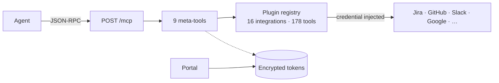

<div align="center">

# a-workbench

**Self-hosted MCP tool aggregator.** One endpoint, per-user OAuth, 178 tools across 16 integrations — behind 9 meta-tools.

[**Documentation**](https://barockok.github.io/workbench/) ·
[Quickstart](https://barockok.github.io/workbench/start/quickstart.html) ·
[Integrations](https://barockok.github.io/workbench/integrations/index.html) ·
[Build a plugin](https://barockok.github.io/workbench/plugins/index.html) ·
[Deploy](https://barockok.github.io/workbench/deploy/install.html)

[](https://github.com/barockok/workbench/actions)
[](https://codecov.io/gh/barockok/workbench)
[](LICENSE)

</div>

---

Give an agent one MCP endpoint instead of sixteen. a-workbench holds a separate
OAuth connection per user per provider, encrypts every token at rest, and exposes
every integration through a fixed set of nine meta-tools — so the agent's tool
list stays the same size whether one integration is connected or all of them.



## Quickstart

```bash
git clone https://github.com/barockok/workbench.git && cd workbench
npm install

cp .env.example .env
# Both are required — the server refuses to boot without them.
echo "ENCRYPTION_KEY=$(openssl rand -hex 32)" >> .env
echo "SESSION_SECRET=$(openssl rand -base64 32)" >> .env

npm run dev
```

Then open the portal, connect an integration, mint an API key, and point your MCP
client at `http://localhost:3000/mcp`. The full walkthrough is in the
[Quickstart](https://barockok.github.io/workbench/start/quickstart.html).

## Documentation

The docs are the product surface — start there, not here.

| Section | What's in it |
|---|---|
| [Get started](https://barockok.github.io/workbench/) | What it is, how it works, connecting an agent |
| [Guides](https://barockok.github.io/workbench/guides/discovering-tools.html) | Discovering and executing tools, OAuth, browser sessions, raw API calls, troubleshooting |
| [Integrations](https://barockok.github.io/workbench/integrations/index.html) | Every provider: exact scopes, setup steps, full tool list |
| [Build plugins](https://barockok.github.io/workbench/plugins/index.html) | Manifest reference, plugin context API, the four auth modes |
| [Deploy](https://barockok.github.io/workbench/deploy/install.html) | Docker, PostgreSQL, portal SSO, security, observability, releases |
| [Reference](https://barockok.github.io/workbench/reference/meta-tools.html) | All 9 meta-tools, every HTTP route, every environment variable, the tool catalog |
| [Field notes](https://barockok.github.io/workbench/field-notes/index.html) | Production failures, root causes, and what changed |

## What's in the box

| | |
|---|---|
| Integrations | 16 on disk, plus 2 internal (`browser`, `jots`) |
| Tools | 178 plugin tools, reached through 9 meta-tools |
| Auth modes | `oauth2`, `apikey`, `cookie`, `none` |
| Agent auth | Workbench API key or OAuth 2.1 (dynamic registration + PKCE) |
| Portal SSO | Google, Keycloak, or both |
| Database | SQLite or PostgreSQL, with a migration path between them |
| Stack | TypeScript, Fastify, MCP TypeScript SDK, React portal |

## Development

```bash
npm run dev      # start dev servers
npm run test     # run tests
npm run build    # build all packages
npm run lint     # lint all packages
```

The docs site is generated from Markdown by a script with no framework:

```bash
node docs/site/build.mjs   # _content/*.md + nav.json → static HTML in docs/site/
```

Rebuild and commit the output with any content change — CI fails the docs build
if `docs/site` is out of date with its source.

See [Contributing](https://barockok.github.io/workbench/reference/contributing.html)
for the branch, commit, and release conventions, and
[SECURITY.md](SECURITY.md) for reporting a vulnerability.

## License

[MIT](LICENSE)
