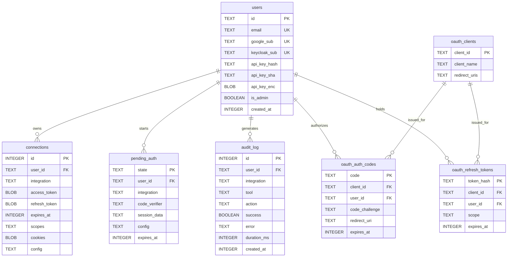

One variable selects the backend. `DATABASE_URL` starting with `postgres://` or
`postgresql://` gets the PostgreSQL adapter. **Anything else is treated as a
SQLite file path.** There is no separate driver setting.

```bash
DATABASE_URL=/data/tokens.db                                  # SQLite
DATABASE_URL=postgres://user:pw@db.internal:5432/workbench    # PostgreSQL
```

The default is `./data/tokens.db`. Both backends implement the same adapter
contract and run the same logical schema, so a deployment can move between them.

> [!WARNING] The relative default resolves against the process working directory
> `./data/tokens.db` is not anchored to the repository root. `npm run dev` starts
> the server with its cwd set to `packages/server`, so the file lands at
> `packages/server/data/tokens.db` — not the repo-root `data/` that
> `docker-compose.yml` bind-mounts to `/data`. The same applies to the other two
> relative defaults, `PLUGINS_DIR=./plugins` and `PORTAL_DIST_DIR=./portal`. Use an
> absolute path anywhere it matters. The Compose file does exactly that with
> `DATABASE_URL=/data/tokens.db`.

## What else derives from `DATABASE_URL`

When it is a file path, two other directories default to siblings of the database
file's own directory:

| Path | Default | Override |
|---|---|---|
| Browser profiles | `dirname(DATABASE_URL)/browser-profiles` | `BROWSER_PROFILES_DIR` |
| Jots file store | `dirname(DATABASE_URL)/jots` | `JOTS_DIR` |

That matters for two reasons. Chromium profiles grow — they filled a shared volume
to 88% in production once — so they share a disk budget with the database unless
you point `BROWSER_PROFILES_DIR` elsewhere. And when you switch `DATABASE_URL` to
a PostgreSQL URL, its dirname is no longer a meaningful filesystem path: set
`BROWSER_PROFILES_DIR` and `JOTS_DIR` explicitly.

Relocating the directories is only half the answer — these are the knobs that
bound what they hold:

| Variable | Default | Bounds |
|---|---|---|
| `BROWSER_SESSION_TTL_SECONDS` | `300` | Idle cutoff before a warm browser session is killed, checked every 30 seconds |
| `BROWSER_PROFILE_TTL_DAYS` | `30` | Age at which an unused whole profile is **deleted** — logging that user out of every cookie-auth integration. `0` disables |
| `BROWSER_PROFILE_REAP_INTERVAL_SECONDS` | `3600` | How often the profile disk reaper runs. It also runs once at boot |
| `BROWSER_DISK_CACHE_MB` | `32` | Chromium's `--disk-cache-size` per profile |
| `JOTS_MAX_BYTES` | `5242880` (5 MiB) | Per-file and total decompressed size cap on a jot upload |
| `JOTS_MAX_FILES` | `1000` | Maximum files in one jot archive |
| `JOTS_UPLOAD_TTL_SECONDS` | `300` | Lifetime of a single-use upload token |

Full validation details are in [environment variables](../reference/environment.md).

## Schema



Both `google_sub` and `keycloak_sub` are unique, but `keycloak_sub` gets its
uniqueness from a **partial** index — `WHERE keycloak_sub IS NOT NULL` — so any
number of users can have it unset while no two can share a value.

`connections` is unique on `(user_id, integration)` — one credential per user per
integration. `pending_auth` carries three different flows discriminated by its
`integration` column: a plugin name for plugin OAuth, `google-sso` / `keycloak-sso`
for portal login, and `__oauth_authorize__` for an MCP authorize ticket.

Column-level detail is in [database schema](../reference/database-schema.md).

## Schema initialization

There is no versioned migration table. `applySchema()` dispatches on the adapter's
dialect and is idempotent: a `CREATE TABLE IF NOT EXISTS` block followed by
additive column adds. On SQLite those are bare `ALTER TABLE … ADD COLUMN`
statements in a try/catch that swallows only "duplicate column name" and rethrows
everything else. On PostgreSQL they are one `ADD COLUMN IF NOT EXISTS` batch.

It runs from an explicit `initDb()` call at boot, before plugins load and before
routes register — not as an import side effect. There is nothing to run by hand.
Starting the server against an empty database creates the schema.

## Migrating SQLite to PostgreSQL

The migration script lives in `packages/server/src/migrate/` and is a dry run
unless you pass `--apply`.

:::steps

### Point it at a source and a target

Source resolution: `SOURCE_SQLITE_PATH`, else `DATABASE_URL` when it is a file
path, else `/data/tokens.db`. Target: `TARGET_DATABASE_URL` (must start
`postgres://` or `postgresql://`, or it throws), else the libpq variables
`PGHOST`, `PGPORT` (default 5432), `PGUSER`, `PGPASSWORD`, `PGDATABASE`.

```bash
export SOURCE_SQLITE_PATH=/data/tokens.db
export TARGET_DATABASE_URL=postgres://user:pw@db.internal:5432/workbench
```

Passwords are redacted from the script's log output.

### Dry run

```bash
npm run migrate:sqlite-to-postgres -w @workbench/server
```

Inside the container the built script is invoked directly:

```bash
tsx server/migrate/sqlite-to-postgres.js
```

The dry run applies the production schema to the target, diffs source against
target columns and reports any source-only column that will not be copied, and
refuses a non-empty target unless you pass `--allow-nonempty`.

### Apply

```bash
npm run migrate:sqlite-to-postgres -w @workbench/server -- --apply --skip=pending_auth,oauth_auth_codes
```

`pending_auth` and `oauth_auth_codes` are minutes-lived handshake state. Skip them
unless the cutover is immediate.

The copy is one transaction, batched and rowid-paged, inserting with
`ON CONFLICT DO NOTHING`. Afterwards every `SERIAL` sequence is resynced with
`setval` — without that the next insert collides on the primary key — and the row
count of each target table is verified against the source, throwing on a mismatch.

### Cut over

The script does not switch anything. Change `DATABASE_URL` to the PostgreSQL URL
and restart. Set `BROWSER_PROFILES_DIR` and `JOTS_DIR` at the same time.

:::

> [!DANGER] `ENCRYPTION_KEY` must not change
> Ciphertext is copied verbatim — access tokens, refresh tokens, cookie bundles,
> and the stored API-key copies are all AES-256-GCM blobs. The key is read once at
> module load, so there is no re-encryption path and no rotation story. Migrate
> with the same `ENCRYPTION_KEY`, and back it up as carefully as the database
> itself. Change it and every user must reconnect every integration.

## Cluster mode

`CLUSTER_ENABLED=true` forks one worker per `availableParallelism()`. Accepted
values are exactly `true`, `false`, `1`, `0` — anything else is a validation error
at boot, not a falsy value.

**Cluster mode requires PostgreSQL.** With a SQLite `DATABASE_URL` the process
prints an explicit message and exits 1. SQLite cannot be safely shared across
processes.

Connection budgeting is the thing to get right:

```
total connections = PG_POOL_MAX × worker count
```

`PG_POOL_MAX` defaults to 2 and is **per worker**. On a 16-core host that is 32
connections from one deployment. Keep the total well under the server's
`max_connections`. `PG_CONNECT_TIMEOUT_MS` (default 5000, `0` = unlimited) caps
how long a request waits for a free pool slot before being rejected.

Two caveats:

- The primary process reforks a dead worker with no backoff, so a worker
  crash-looping on bad configuration will spin.
- Graceful shutdown — `SIGTERM`/`SIGINT` → drain the pool → exit — is registered
  per worker, not on the primary. The primary dies on the default signal
  disposition.

Some state is per-process and therefore not shared across workers: the SSO nonce
map and the transient connect-flow records that `connect` / `wait_for_connection`
poll. Sticky routing avoids surprises there.

## PostgreSQL behaviours worth knowing

These are handled inside the adapter, but they explain what you'll see and why a
custom query written against the wrong assumption breaks.

| Behaviour | Consequence |
|---|---|
| PostgreSQL rejects `1`/`0` for a `BOOLEAN` column | `audit_log.success` and `users.is_admin` are bound as real booleans; the SQLite adapter converts on the way in |
| `?` is not always a placeholder | The adapter's parameter rewriter is a hand-written SQL scanner that skips comments, string literals, quoted identifiers and dollar-quoted strings, and leaves the JSONB `?`, `?|`, `?&` operators alone |
| A transaction is pinned to one pooled client | Inside a `transaction()` callback you must use the executor handed to you — a stray call on the shared `db` silently takes a different connection and runs outside the transaction |
| SQLite transactions are serialized in-process | `better-sqlite3` is synchronous behind an async API, so the SQLite adapter chains transactions through a queue to avoid "cannot start a transaction within a transaction" |

The audit log's `sqlite` destination writes through the shared adapter, so despite
the name it inserts into whichever backend is configured, PostgreSQL included.
