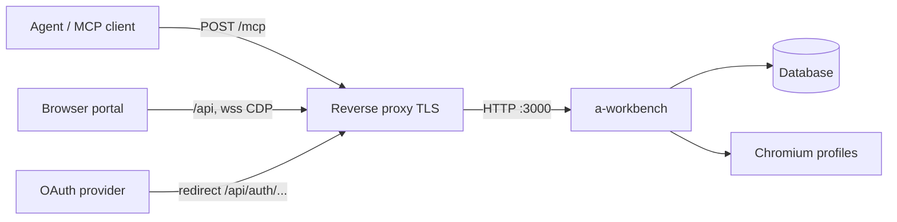

Released images are published to GHCR as `ghcr.io/<owner>/<repo>` (the repository
path lowercased), tagged with the git tag. `latest` moves only on stable
releases — see [releases and upgrades](releases.md).

> [!WARNING] Published images are `linux/amd64` only
> The release workflow's build step passes no `platforms:`, so GHCR gets a
> single-architecture image from the `amd64` GitHub runner. ARM hosts — Apple
> Silicon, Graviton — get emulation at best. Build locally on the target
> architecture instead.

## What the image builds

Two stages, both `node:20-bookworm-slim`. Debian on both sides is deliberate:
`better-sqlite3` is a native module and Playwright's chromium targets glibc, so an
Alpine/musl stage would break the native ABI when `node_modules` is copied across.

The builder stage installs `python3 make g++` (for a native-dep build if no
prebuild matches), copies only the four `package.json` files plus the lockfile for
a cacheable `npm ci`, then runs `npm run build`.

The runtime stage copies:

| From | To in image |
|---|---|
| `packages/server/dist` | `/app/server` |
| `node_modules` | `/app/node_modules` |
| `packages/portal/dist` | `/app/portal` |
| `packages/plugins` | `/app/plugins` |

It then deletes `node_modules/@a-workbench` and re-materializes
`@a-workbench/shared` as a real package — the workspace symlinks dangle because
`packages/` is not shipped. Chromium is baked in with
`npx playwright install --with-deps chromium` and made world-readable so any
runtime uid can execute it. `tsx@4.19.4` is installed globally.

| | Value |
|---|---|
| Exposed port | 3000 |
| Command | `tsx server/index.js` |
| `NODE_ENV` | `production` |
| `PLAYWRIGHT_BROWSERS_PATH` | `/ms-playwright` |

The entrypoint runs the *built JavaScript* through `tsx` because plugins are
`import()`ed as `.ts` files at runtime.

The image has no `USER` directive, so the process runs as root. That is why
chromium is always spawned with `--no-sandbox` and `--disable-dev-shm-usage` —
chromium refuses to start as root otherwise.

## Healthcheck

There isn't one. The Dockerfile declares no `HEALTHCHECK`, and the server exposes
no `/health`, `/healthz`, or `/readyz` route.

The only probe-able HTTP endpoint is `GET /metrics`, which is unauthenticated. Use
that or a plain TCP check on the listen port for orchestrator liveness probes. See
[observability](observability.md).

## Compose services

`docker-compose.yml` defines two services.

**`a-workbench`** — `build: .`, published on `3000:3000`.

- `env_file: [.env]` pulls SSO credentials *and* every per-plugin OAuth
  credential. Without them `/authorize` and `connect(<plugin>)` fail with
  `"<X> not configured"`.
- An `environment:` block sets six values so a developer `.env` cannot leak into
  the container and break the port mapping or the data volume: `PORT=3000`,
  `NODE_ENV=production`, `DATABASE_URL=/data/tokens.db`, `SERVER_PUBLIC_URL` and
  `PORTAL_URL` (both defaulting to `http://localhost:3000`), and
  `PLUGINS_DIR=/app/custom-plugins`.
- Volumes: `./data:/data` for the database and everything derived from its
  directory, plus `../custom-plugins:/app/custom-plugins:ro`.
- No healthcheck, no restart policy, no `depends_on`.

> [!WARNING] The committed Compose file cannot run a published release
> The service declares `build: .` and **no `image:` key**, so `docker compose pull`
> skips it entirely and `docker compose up -d` builds from your working tree. To
> run a GHCR tag you have to add an `image:` key — see
> [the upgrade procedure](releases.md).

**`sample-oauth`** — built from `Dockerfile.sample-oauth` on `3002:3002` with
`NODE_ENV=development`. A test OAuth provider for contributors, not something to
run in production.

There is **no `postgres` service**. If you want PostgreSQL, bring your own and
point `DATABASE_URL` at it — see [database](database.md).

> [!WARNING] The committed Compose file carries someone's local overrides
> One comment in `docker-compose.yml` is marked "LOCAL ONLY (do not commit)" and
> was committed anyway: the override `PLUGINS_DIR=/app/custom-plugins`. The bind
> mount it goes with, `../custom-plugins:/app/custom-plugins:ro`, is unmarked but
> just as local — its source is a *sibling of the repository*, so on any machine
> without that directory Docker creates it (owned by root) and you get an empty
> read-only mount rather than an error. The external-plugin pass then finds
> nothing there. Delete both lines, or create the directory, before using the file
> as-is.

One more Compose gap: `SESSION_SECRET` is not in the `environment:` block, so it
has to come from `.env`. With `NODE_ENV=production` forced on and no value
supplied, the empty default fails the 32-character minimum and the container exits
at import.

## Mounting an external plugins directory

Loading happens in two independent passes, and only the second one is governed by
`PLUGINS_DIR`.

| Pass | Where it looks | Controlled by |
|---|---|---|
| Built-ins | The first of `../plugins`, `../../plugins`, `./plugins` that exists, relative to the process working directory | Nothing — `PLUGINS_DIR` is not consulted |
| External | `PLUGINS_DIR`, resolved to an absolute path before `import()` | `PLUGINS_DIR` |

So pointing `PLUGINS_DIR` somewhere else does not unload the built-ins, and it
cannot be used to relocate them either. In the image the working directory is
`/app`, so the built-in probe finds `/app/plugins`; `PLUGINS_DIR` defaults to
`./plugins`, which resolves to that same directory, which is why the default
configuration loads the built-ins once rather than twice — the external pass skips
built-in directory names. The loader also refuses to load a directory named
`browser` or `jots` (reserved for the internal plugins).

To add your own plugins, mount them somewhere else and point `PLUGINS_DIR` there:

:::tabs
```yaml [docker-compose]
services:
  a-workbench:
    image: ghcr.io/<owner>/<repo>:v0.24.0
    ports:
      - "3000:3000"
    env_file: [.env]
    environment:
      - PORT=3000
      - NODE_ENV=production
      - DATABASE_URL=/data/tokens.db
      - PLUGINS_DIR=/app/custom-plugins
      - SERVER_PUBLIC_URL=https://workbench.example.com
      - PORTAL_URL=https://workbench.example.com
    volumes:
      - ./data:/data
      - ./custom-plugins:/app/custom-plugins:ro
```
```bash [docker run]
docker run -d --name a-workbench \
  -p 3000:3000 \
  --env-file .env \
  -e DATABASE_URL=/data/tokens.db \
  -e PLUGINS_DIR=/app/custom-plugins \
  -e SERVER_PUBLIC_URL=https://workbench.example.com \
  -e PORTAL_URL=https://workbench.example.com \
  -v "$PWD/data:/data" \
  -v "$PWD/custom-plugins:/app/custom-plugins:ro" \
  ghcr.io/<owner>/<repo>:v0.24.0
```
:::

Keeping the mount inside the repository directory means the file works for anyone
who clones it. If you set `PLUGINS_DIR` to a directory that does not exist, the
loader returns quietly and only the built-ins are registered.

## Behind a reverse proxy

The server binds `0.0.0.0` on `PORT` and serves the portal itself — the built SPA
comes from `PORTAL_DIST_DIR` (`/app/portal` in the image), registered last so
`/api`, `/mcp`, and `/.well-known` 404s stay JSON and only genuine client routes
fall through to `index.html`. A single origin therefore serves the portal, the
HTTP API, the MCP endpoint, and the curl proxy.



Set both public URLs to the externally reachable origin:

| Variable | Set to | Why it matters |
|---|---|---|
| `SERVER_PUBLIC_URL` | The public origin of the server, e.g. `https://workbench.example.com` | Base for every OAuth redirect URI, the MCP protected-resource and authorization-server metadata, the `iss`/`aud` of OAuth access tokens, and whether the `awb_oauth_binding` cookie gets `Secure` (it does only when the value starts with `https://`) |
| `PORTAL_URL` | The origin the browser loads the portal from — the same value, when the server serves the SPA | SSO and connect redirect target, and half of the WebSocket `Origin` allowlist |

The allowlist for the CDP live-view WebSockets is exactly the set
`{PORTAL_URL, SERVER_PUBLIC_URL}`. Anything else is rejected with a 403 on the
upgrade.

> [!WARNING] Only the incoming `Origin` is normalized — the allowlist is compared verbatim
> The browser's `Origin` header is reduced to `protocol//host` before the lookup,
> but `PORTAL_URL` and `SERVER_PUBLIC_URL` go into the set exactly as you wrote
> them. A trailing slash, a path suffix, or an explicit default port
> (`https://workbench.example.com:443`) can therefore never match any real origin,
> and every CDP upgrade 403s. Set both variables to a bare scheme-and-host origin
> with no trailing slash.

If cookie capture or the live browser view fails with a 403 behind your proxy,
check the two variables for that exact shape first, then check that they match the
origin the browser is actually using.

Your proxy must also forward WebSocket upgrades for `/api/auth/cookie/:integration/cdp`
and `/api/browser-session/cdp`, and preserve the `Origin` header.

Run TLS at the proxy. The server speaks plain HTTP.
