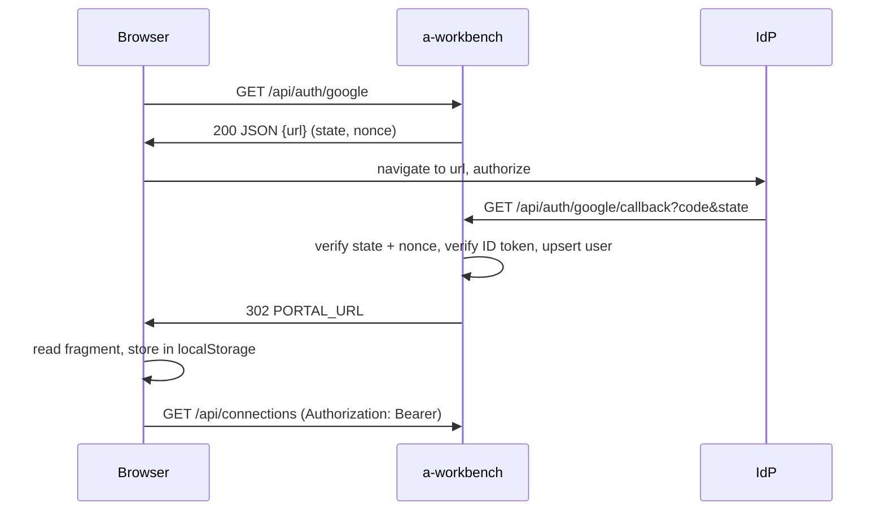

The portal has no password login. Users sign in through an OIDC provider, and a
user row is created on first successful callback. Two providers are supported and
both are optional; you can enable either, both, or neither (in which case the only
way to create a user is the seed script — see [install](install.md)).

| Provider | Enabled when | Callback URL |
|---|---|---|
| Google | `GOOGLE_CLIENT_ID` is set | `${SERVER_PUBLIC_URL}/api/auth/google/callback` |
| Keycloak | all three `KEYCLOAK_*` vars are set | `${SERVER_PUBLIC_URL}/api/auth/keycloak/callback` |

> [!WARNING] The redirect URI is a server path, not a portal path
> It is built from `SERVER_PUBLIC_URL` and starts with `/api/auth/`. Older
> documentation — including the comment in `.env.example` — describes
> `${PORTAL_URL}/auth/google/callback`. That value is wrong and will fail with a
> `redirect_uri_mismatch` in the provider console. The same helper builds the URI
> for both the authorize redirect and the token exchange, so the two are always
> byte-identical; there is nothing to align by hand except what you register with
> the provider.

## Google

```bash
GOOGLE_CLIENT_ID=...apps.googleusercontent.com
GOOGLE_CLIENT_SECRET=...
SERVER_PUBLIC_URL=https://workbench.example.com
```

Register `https://workbench.example.com/api/auth/google/callback` as an authorized
redirect URI on the OAuth client.

The flow uses OIDC discovery against
`https://accounts.google.com/.well-known/openid-configuration`, requests scopes
`openid email profile` with `access_type=online`, and carries both a `state` and a
`nonce`. The callback verifies the ID token against Google's JWKS, accepting either
of Google's two published issuer spellings — `https://accounts.google.com` and the
bare `accounts.google.com` — with the audience pinned to `GOOGLE_CLIENT_ID` and 60
seconds of clock tolerance, then checks the nonce.

Accounts whose email is not verified are rejected. A returning user is matched on
`google_sub`; otherwise the server links by email address; otherwise it creates a
new user.

`GOOGLE_CLIENT_ID` alone is enough to make the provider appear and to build an
authorize URL, but without `GOOGLE_CLIENT_SECRET` the token exchange throws
"Google OAuth not configured" at the callback. Set both.

These credentials are for **portal login only**. They are unrelated to the
`GOOGLE_GMAIL_CLIENT_ID`-style per-plugin credentials used to connect Google
integrations.

## Keycloak

```bash
KEYCLOAK_ISSUER_URL=https://sso.example.com/realms/engineering
KEYCLOAK_CLIENT_ID=a-workbench
KEYCLOAK_CLIENT_SECRET=...
SERVER_PUBLIC_URL=https://workbench.example.com
```

All three must be set — the provider reports itself configured only when none is
missing. `KEYCLOAK_ISSUER_URL` must parse as a URL, or boot fails.

In Keycloak, create a confidential client (client authentication on, standard flow
enabled) and add `https://workbench.example.com/api/auth/keycloak/callback` as a
valid redirect URI. Configuration is read from
`${KEYCLOAK_ISSUER_URL}/.well-known/openid-configuration` and cached, so the realm
must be reachable from the server at first login.

The flow mirrors Google's: authorization code, ID token verified against the
realm's JWKS with the audience pinned to `KEYCLOAK_CLIENT_ID`, users linked or
created on `keycloak_sub`. It is a confidential-client flow with no PKCE.

Two behavioural differences to be aware of:

- **Email verification is checked more loosely.** Keycloak logins are rejected only
  when the token carries `email_verified: false`; an absent claim passes. Google
  rejects an absent claim too. Configure the realm to emit the claim if you rely
  on it.
- **Keycloak cannot complete an MCP `/authorize` handshake.** The MCP OAuth
  authorize endpoint hardcodes the Google authorize URL, and the Keycloak callback
  never resumes an authorize ticket. Keycloak works for portal login; agents
  authorizing over MCP OAuth 2.1 need Google configured. Agents can also
  authenticate with a workbench API key, which is provider-independent.

## Provider discovery

```bash
curl https://workbench.example.com/api/auth/providers
```

Returns the list of enabled providers — `"google"` when `GOOGLE_CLIENT_ID` is set,
`"keycloak"` when the three Keycloak variables are set. The portal calls this to
decide which sign-in buttons to render, so an empty list means a login page with
nothing on it. Use it to check your configuration landed before opening a browser.

## The session model



Note the first hop: `GET /api/auth/google` (and `/api/auth/keycloak`) does not
redirect. It returns `{ url }` as JSON — or **503** with an error when the provider
is unconfigured — and the portal's fetch reads `url` and navigates the browser
there itself. The only route that answers with a 302 to Google is the MCP OAuth
`GET /authorize`.

The session is a stateless **HS256 JWT** signed with `SESSION_SECRET`. Claims are
`sub` (the user id), `email`, `iat`, `exp`, plus `aud` and `iss` both set to
`a-workbench`; verification enforces the audience, the issuer, and 5 seconds of
clock tolerance. The lifetime is **24 hours**.

After either callback the server redirects to `PORTAL_URL` with the token in the
**URL fragment** — not a query parameter, so it is never sent to the server or
written to an access log. The portal reads the fragment once, stores the token in
`localStorage` under `awb_token`, and sends it as `Authorization: Bearer` on every
API call. The portal session uses no cookies at all.

> [!WARNING] Logout is client-side only
> `POST /api/auth/logout` returns success and revokes nothing. There is no session
> revocation list, so a leaked session JWT stays valid for its full 24 hours.
> Rotating `SESSION_SECRET` invalidates every session at once — and simultaneously
> every MCP OAuth access token, connect token, curl-session token, and jot unlock
> cookie, since all of them are keyed on the same secret.

For how the session JWT relates to the other credentials the server accepts, see
[the security model](security.md).
