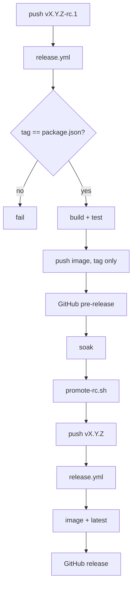

Releases are cut by pushing a git tag. That is the only trigger — there is no
manual publish step and no separate changelog job.

## Version and tag conventions

| Kind | Tag | GitHub release | Docker `latest` |
|---|---|---|---|
| Stable | `vX.Y.Z` | normal release | moves to this build |
| Release candidate | `vX.Y.Z-rc.N` | pre-release | **does not move** |

The pre-release flag is derived from the tag containing a hyphen, and the `latest`
Docker tag is applied only when the tag contains no hyphen. So the RC convention
is enforced by the tag's shape, not by a flag someone has to remember.

Anything touching the Docker image, the database schema, auth, or the proxy goes
out as an RC first. Pull it explicitly by tag:

```bash
docker pull ghcr.io/<owner>/<repo>:v0.25.0-rc.1
```

Soak it, then promote.

> [!WARNING] Published images are `linux/amd64` only
> The release workflow's build step sets no `platforms:`, so GHCR receives a
> single-architecture image built on the GitHub-hosted `amd64` runner. On Apple
> Silicon or Graviton it runs under emulation if your Docker supports it, and
> fails to start if it does not. Build the image yourself on the target
> architecture (`docker build -t workbench .`) for ARM hosts.

> [!WARNING] The tag and `package.json` must agree
> The release workflow greps the version out of `package.json` and fails the build
> when `v${version}` does not equal the tag being built. The Docker tag comes from
> the git tag while the running app reports `package.json`, so a mismatch would
> ship a release that lies about its own version.

## Release notes

Every release ships a hand-written `docs/releases/<tag>.md`. The workflow prefers
that file and copies it verbatim into the GitHub release body. Without it, the
release body is an auto-generated `git log` dump plus a compare link. The range
runs from the **highest-versioned other tag** to this one — `git tag --sort=-v:refname`
with the tag being built filtered out. That is the previous release in the normal
case, but not when you rebuild an older tag via `workflow_dispatch`: there the
range is computed against a *newer* tag and the log comes out empty or backwards.

Notes live under the **stable** name — `docs/releases/vX.Y.Z.md` — from the first
release candidate onward. That means an RC build itself falls back to the git-log
changelog. That is fine, because the notes are for the stable release the RC is
rehearsing.

Group notes by category, explain why a change was made rather than restating the
commit subject, and link the relevant findings document when one exists.

## Promoting a release candidate

```bash
scripts/promote-rc.sh v0.25.0-rc.1 [--dry-run]
```

The script strips the `-rc.N` suffix, bumps `package.json` to the stable version,
commits, tags, and — after a `[y/N]` prompt — pushes `main` and the tag, which
fires the release workflow. It refuses to run unless every one of these holds:

- the argument matches `vX.Y.Z-rc.N`
- the RC tag exists and the stable tag does **not**
- you are on `main` with a clean working tree (untracked files ignored)
- the RC tag is an ancestor of `HEAD` — `main` has not diverged from what you soaked
- `docs/releases/<stable>.md` exists

The tag checks run against **local** refs, after a `git fetch --tags origin`. A
stable tag you created locally and never pushed still trips the "already exists"
refusal. Delete it with `git tag -d` first.

Before it does anything it prints `git log --oneline <rc>..HEAD` under the heading
`commits landed since <rc> (these ship untested by the RC build):`. Read that
list. If it is non-empty, the thing you soaked is not the thing you are about to
release.

The `package.json` bump and its commit are **conditional** — skipped when the file
already holds the stable version, which is the normal case after a repeat run. The
tag is always created.

`--dry-run` prints the push commands and exits without tagging. Declining the
final prompt deletes the local tag but keeps the version-bump commit.

## What CI does

**`ci.yml`** runs on pushes and pull requests to `main`, across a Node 20 and 22
matrix, with a `postgres:16` service container. The PostgreSQL half of the
database adapter suite skips itself without a live server, which would leave the
backend untested, so CI provides one via `TEST_POSTGRES_URL`.

Steps: `npm ci` → `npm run lint` → `npm run build` →
`npm run typecheck:tests -w @workbench/server` →
`npm run test:coverage -w @workbench/server` → Codecov upload with
`fail_ci_if_error: true`.

Two things to know about that list. `npm run lint` is a no-op — no package defines
a `lint` script, so the turbo task resolves to zero work and exits 0. And the
separate typecheck step exists because the main `tsconfig.json` covers only `src/`,
so the build never type-checks the test suite.

**`release.yml`** runs on a `v*.*.*` or `v*.*.*-*` tag push, or via
`workflow_dispatch` with a tag input to rebuild an existing tag. It checks out the
tag with full history, verifies the tag against `package.json`, builds and tests on
Node 20, assembles the release notes, builds the image with Buildx and pushes it to
GHCR with GitHub Actions layer caching, then creates the GitHub release as a draft
and immediately publishes it — a two-step needed for repositories with an
immutable-releases policy.



## Upgrading a running deployment

:::steps

### Read the release notes first

`docs/releases/<tag>.md` and the linked findings documents are where breaking
changes and required operator actions are written down.

### Back up the database

The schema applies additively at boot — `CREATE TABLE IF NOT EXISTS` plus
`ADD COLUMN` — so an upgrade is not reversible by simply running the old image
against the same database. Take a copy of the SQLite file or a `pg_dump` first.

### Keep `ENCRYPTION_KEY` and `SESSION_SECRET` unchanged

Changing `ENCRYPTION_KEY` makes every stored credential undecryptable. There is no
re-encryption path. Changing `SESSION_SECRET` invalidates every portal session,
MCP access and refresh token, connect token, curl session, and jot cookie at once.

### Move to the new version and restart

What this step is depends on how your Compose file gets the image, and the
committed one is not what most people assume.

> [!WARNING] `docker compose pull` does not fetch a release with the shipped file
> The `workbench` service in the committed `docker-compose.yml` declares
> `build: .` and **no `image:` key**. Compose skips a service with no `image:` on
> `pull` — it prints a "must be built from source" warning and pulls nothing — and
> `up -d` then rebuilds from whatever is in your local working tree. The published
> GHCR tag is never fetched. Pick one of the two procedures below.

**Running the published image.** Add an `image:` key naming the GHCR tag and drop
`build:`, in an override file so the repo copy stays untouched:

```yaml
# docker-compose.override.yml
services:
  workbench:
    image: ghcr.io/<owner>/<repo>:v0.25.0
```

`<owner>/<repo>` is your repository path lowercased — the workflow lowercases
`GITHUB_REPOSITORY` before tagging. Then, for each upgrade, edit the tag in that
file and:

```bash
docker compose pull && docker compose up -d
```

Compose still honours `build:` from the base file for a `docker compose build`,
but with `image:` present `pull` and `up` use the registry copy.

**Building from source.** Check out the release tag and rebuild — there is no
image to pull:

```bash
git fetch --tags && git checkout v0.25.0
docker compose up -d --build
```

Either way, schema changes apply automatically at boot, before plugins load and
before routes register. Watch the first few log lines: a configuration validation
failure aborts the process at import, before it binds a port.

### Check whether users must reconnect

Some releases change the OAuth scopes a plugin requests. Existing stored tokens
carry the *old* scope set, so the new tools 401 or 403 until each affected user
disconnects and reconnects that integration in the portal. This has happened for
Confluence (the REST v2 migration replaced the classic content scopes with
granular `read|write|delete:page:confluence` and `read:space:confluence`) and for
Bitbucket (pipeline triggering required adding `pipeline` and `pipeline:write`).
When a release does this, say so in the notes and tell users before they hit it.

:::

> [!NOTE] Rolling back
> Rolling the image back is straightforward as long as the schema is only
> additive — the older code ignores columns it does not know about. What does not
> roll back is a `DATABASE_URL` cutover from SQLite to PostgreSQL, or any change to
> the two secrets. Treat those as one-way.
