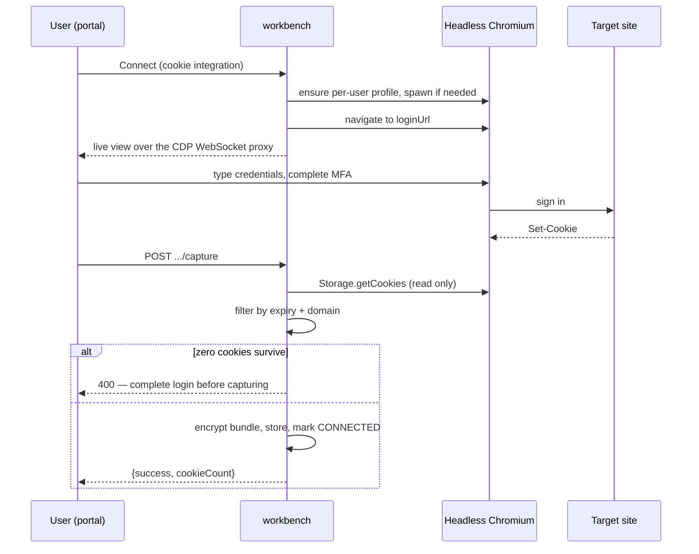

Plenty of internal tools and SaaS products have no OAuth app you can register — no
client id, no consent screen, nothing to point a callback at. For those, a plugin can
declare `auth.type: "cookie"`: the user logs in through a headless Chromium running on
the server, and the workbench captures the resulting session cookies and replays them on
tool calls.

`httpbin-cookie` is the shipped reference plugin for this mode.

The tradeoff is honest: cookie auth gets you a working integration where OAuth is not on
offer, at the cost of holding a live session credential and a persistent browser profile
per user. Everything below is about containing that cost.

## The capture flow

The user never installs anything. They open a URL, log in inside a live view of the
server's browser, and click Capture.



An agent can start the same flow: `connect("<integration>")` on a cookie integration
returns a workbench link carrying a short-lived connect token, then
`wait_for_connection` blocks until Capture succeeds. The link names the workbench
user the agent is connected to, and the user does need a portal session to use it —
they must be signed in as that same user, or the server refuses with a mismatch
error instead of warming the browser session.

## Per-user profiles

Each workbench user gets **one persistent Chromium profile directory**, named from a
sanitized form of their user id and created with `0700` permissions. It is reused across
every cookie integration and every capture.

That persistence is the feature: a user who has already signed in to their identity
provider inside this profile does not sign in again for the next cookie integration.
Sessions carry over exactly as they would in a normal browser.

### One session, shared by capture and the browser tools

There is one warm Chromium per user, and both paths use it. Capture and every `browser_*`
tool go through the same `ensureSession` call, which returns the existing warm session if
there is one. So a capture can start while an agent is driving the browser, and an agent
can drive a browser the user is logged into mid-capture. That is deliberate: cancelling a
capture is a no-op precisely because the browser may still be in use by the agent.

`BROWSER_SESSION_BUSY` is therefore not a "capture vs. agent" error. It is raised in two
narrow cases:

| Raised by | When |
|---|---|
| `ensureSession` | The profile is claimed but no warm session exists yet — a spawn for this user is in flight |
| `resetBrowserProfile` | A profile wipe is requested while the profile is claimed |

Only two endpoints map it to **409**: `POST /api/browser-session/reset` and
`POST /api/browser-session/live-url`. The capture endpoints do not — they turn every
error, this one included, into **400** with the error message in the body.

If an agent is holding a warm browser session, `browser_close` ends the process without
destroying the profile.

Warm sessions are also idle-reaped: `BROWSER_SESSION_TTL_SECONDS` (default 300),
checked every 30 seconds, then the process is killed. The profile survives.

## Cookie domain scoping

Capture is a pure read — it enumerates cookies over CDP and stores nothing until the
filter has run. Two rules apply:

1. **Expired cookies are dropped.**
2. **Only cookies whose domain matches the target are kept** — the cookie's bare domain
   must equal, or be a subdomain of, the manifest's `targetDomain` or one of its
   declared `cookieDomains`.

Rule 2 exists because a shared profile accumulates cookies from every site the user has
ever visited in it. Storing all of them and replaying all of them produced a `Cookie`
header large enough for providers to reject the request outright — HTTP 400, header too
large — or to return an empty session. Scoping to the target host is what a real browser
does, and it is what the capture does now.

The same filter runs again at request time: `ctx.http()` builds the `Cookie` header from
only the unexpired cookies matching the host it is about to call. It also enforces that
the host is one the manifest declared, and sets `redirect: "manual"` so cookies are never
replayed across a redirect hop to somewhere else.

### Liveness is "at least one live cookie"

A connection counts as connected when a bundle exists **and at least one cookie in it is
unexpired** — not when none have expired. Session bundles routinely mix a long-lived
refresh cookie with short-lived junk. Requiring all of them to be live would report every
working session as broken within the hour.

### Capture with zero cookies is a hard failure

If the filter leaves nothing, capture returns **400** with
`No cookies captured. Complete login before capturing.` — *before* storing anything and
before marking the connection CONNECTED.

This guard exists because the alternative was worse: an early version marked the
connection CONNECTED on an empty capture, producing an integration that looked healthy
in the portal and failed on every call. Both capture endpoints (portal and connect-link)
enforce it.

Cancelling a capture is a deliberate no-op — it does not kill the shared browser, since
another integration may be mid-flow. The idle reaper handles it.

## Moving a session between deployments

Two endpoints exist for portability, both owner-scoped:

```bash
# export
curl https://workbench.example.com/api/integrations/httpbin-cookie/session/export \
  -H "x-workbench-api-key: $KEY"
# {"integration":"httpbin-cookie","session":{…}}

# import (accepts the bundle, or a bare cookie array)
curl -X POST https://workbench.example.com/api/integrations/httpbin-cookie/session/import \
  -H "x-workbench-api-key: $KEY" -H 'Content-Type: application/json' \
  -d '{"session":{…}}'
# {"success":true,"cookieCount":7}
```

An empty or invalid bundle is rejected with 400. A successful import marks the
connection CONNECTED, same as a capture.

## The profile reaper

Persistent profiles grow without bound, and they live on the same volume as the
database. Two mechanisms keep them in check.

**At spawn**, Chromium is started with disk-discipline flags — background networking,
component updates, client-side phishing detection, sync and crash reporting all
disabled, and `--disk-cache-size` set from `BROWSER_DISK_CACHE_MB`. Disabling background
networking is the load-bearing one: it stops each profile from downloading its own
multi-megabyte Safe Browsing blocklist.

**On chromium exit**, regenerable caches are trimmed. This is hooked to the process
`exit` event rather than to a clean shutdown path, so a crashed or reaped browser is
cleaned up identically to one that closed politely.

**On a timer**, a sweep runs every `BROWSER_PROFILE_REAP_INTERVAL_SECONDS` (and once
immediately at startup). It trims caches in every profile, deletes whole profiles idle
past `BROWSER_PROFILE_TTL_DAYS`, and skips any profile with a live session.

Staleness is measured from the mtime of the profile's `Cookies` and `Preferences` files,
not the directory's own mtime — trimming caches touches the directory, which would make
every profile look freshly used forever.

## Operator settings

| Variable | Default | Required | Purpose |
|---|---|---|---|
| `BROWSER_PROFILES_DIR` | `<dirname of DATABASE_URL>/browser-profiles` | no | Where per-user profiles live. Defaults next to the database, which is usually not what you want on a small volume |
| `BROWSER_SESSION_TTL_SECONDS` | `300` | no | Idle seconds before a live browser process is killed. The profile is kept |
| `BROWSER_PROFILE_TTL_DAYS` | `30` | no | Age at which a whole profile is deleted. `0` disables profile deletion |
| `BROWSER_PROFILE_REAP_INTERVAL_SECONDS` | `3600` | no | Sweep interval; also runs once at boot |
| `BROWSER_DISK_CACHE_MB` | `32` | no | Becomes Chromium's `--disk-cache-size` |
| `CAPTURE_PROXY` | — | no | Upstream proxy for the capture browser, e.g. `http://host:3128` or `socks5://host:1080` |
| `CAPTURE_PROXY_USERNAME` | — | no | Proxy username; needs `CAPTURE_PROXY` and the password too |
| `CAPTURE_PROXY_PASSWORD` | — | no | Proxy password |

The three `CAPTURE_PROXY*` variables are read straight from the environment and are not
part of the validated config schema, so a typo in one is silently ignored rather than
failing at boot.

> [!WARNING] `BROWSER_PROFILE_TTL_DAYS` deletes profiles by default
> The default of 30 days means a profile untouched for a month is removed entirely —
> which logs that user out of **every** cookie integration at once and out of any
> identity provider session the profile was carrying. They must repeat every capture.
> This is a real deletion on a timer, not a cache trim. Raise it, or set it to `0` to
> disable whole-profile deletion and keep only the cache trimming, if your users connect
> cookie integrations infrequently.

### The CAPTURE_PROXY datacenter-IP trap

If the workbench runs in a cloud or cluster, its egress IP is a datacenter IP — and
several login providers treat interactive sign-in from those very differently from
API traffic. Google SSO in particular fails interactive sign-in from datacenter ranges,
so a capture that works on a laptop returns a server error inside the live view when run
in-cluster.

`CAPTURE_PROXY` is the fix: route the capture browser's traffic out through a clean
residential or ISP IP. It affects only the capture browser, not the server's own
outbound API calls.

For an authenticated proxy, note the shape of the constraint:

- Chromium cannot take proxy credentials on the command line, and cannot authenticate to
  a SOCKS5 proxy at all.
- So credentials are supplied over CDP, answering the proxy's auth challenge. That works
  for an **`http://`** proxy with `CAPTURE_PROXY_USERNAME` and `CAPTURE_PROXY_PASSWORD`
  set alongside `CAPTURE_PROXY`. `CAPTURE_PROXY` on its own is enough to route traffic —
  it becomes Chromium's `--proxy-server` regardless. It is the *credential* handler that
  needs all three. With only one or two set, the proxy is used but nothing answers its
  auth challenge.
- For SOCKS5, use IP allow-listing at the proxy instead of credentials.

## Resetting a profile

```bash
curl -X POST https://workbench.example.com/api/browser-session/reset \
  -H "x-workbench-api-key: $KEY"
```

This wipes the user's entire profile directory — the same effect as a TTL expiry, on
demand. It returns 409 while a session is active. Use it when a profile is corrupted or
a user wants their server-side browser state gone.

## Related failures

Cookie auth has the most operational sharp edges of any auth mode. Chromium refusing to
start as root, stale singleton locks after a pod rollover, profiles filling the volume,
and the bodyless-POST 400 on capture are all covered in
[Troubleshooting](troubleshooting.md).
