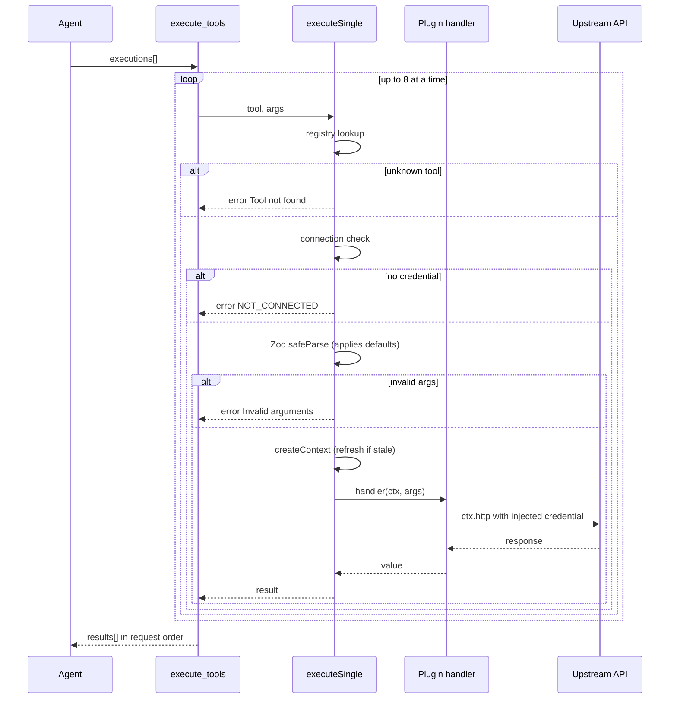

`execute_tools` is the only way to run a plugin tool. Everything the catalog offers —
all 178 tools across 16 plugins, plus the built-in `browser` and `jots` tools — is
reached through this single meta-tool.

> [!WARNING] There is no `execute_tool` (singular)
> The single-tool variant was collapsed into the batch tool and no longer exists. Calling
> it returns a JSON-RPC error, code `-32602`, `Tool not found: execute_tool`. To run one
> tool, pass a one-element `executions` array.

## The call shape

```json
{"jsonrpc":"2.0","id":1,"method":"tools/call","params":{
  "name": "execute_tools",
  "arguments": {
    "executions": [
      { "tool": "github_list_prs", "args": { "owner": "acme", "repo": "demo-repo" } },
      { "tool": "jira_search_issues", "args": { "jql": "project = ACME AND status = Open" } }
    ]
  }
}}
```

| Field | Required | Notes |
|---|---|---|
| `executions` | yes | Array, at least one element |
| `executions[].tool` | yes | Tool name from `search_tools` |
| `executions[].args` | no | Object; defaults to `{}` |

The response is a `results` array, **index-aligned with `executions`**:

```json
{
  "results": [
    { "result": { "…": "github payload" } },
    { "error": "NOT_CONNECTED", "integration": "atlassian-jira",
      "message": "atlassian-jira not connected. Use connect('atlassian-jira') to connect." }
  ]
}
```

Each entry is either `{result}` or an error object. A failure in one execution never
aborts the others — this is the point of the batch shape. Executions run concurrently
through a bounded worker pool with a fixed concurrency of **8**, so a fifty-item batch
opens at most eight upstream connections at a time. Ordering is preserved regardless,
because each worker writes to the index it claimed.

For a single tool, the array has one element:

```json
{ "executions": [ { "tool": "list_jots", "args": {} } ] }
```

## What happens to each execution

Per item, in order. The engine never throws — every failure is converted to a returned
object.

:::steps

### Tool lookup

The registry is looked up by name. Unknown name → `{"error": "Tool not found"}`, audit
logged, done.

### Connection check

The tool's owning integration is resolved, and its auth type decides:

| Auth type | Connected when |
|---|---|
| `none` | always — `browser` and `jots` need no credential |
| `cookie` | a cookie bundle exists and at least one cookie is unexpired |
| everything else | a stored access token exists |

Not connected → the `NOT_CONNECTED` shape below.

### Argument validation

Args are `safeParse`d against the plugin tool's own Zod schema — the same schema
`get_tool_schema` renders as JSON Schema. This step is not just a guard: it is where
Zod `.default()` values get applied, so an optional-with-default field reaches the
handler with its default rather than `undefined`. Failure → the invalid-arguments shape
below.

### Context creation

`createContext(userId, integration)` builds a fresh per-call `ctx`, carrying
`ctx.userId`, `ctx.getToken()`, `ctx.getConfig()` and `ctx.http()`. Token refresh
happens lazily here — if the stored access token expires within 30 seconds,
`getToken()` refreshes and re-stores it before returning.

### Handler run

`handler(ctx, parsedArgs)`. A returned value becomes `{result}`. A thrown error becomes
`{error: "<message>"}`.

:::

Every path — including the ones that never reach a handler — writes an audit event with
`action: "EXECUTE"`, the user, tool, success flag, error, and duration. `integration` is
on all of them but one: when the tool name resolves to nothing, there is no integration
to record. The
run path additionally emits a structured JSON log line and increments the
`workbench_tool_executions_total` counter and `workbench_tool_execution_duration_seconds`
histogram, labelled by integration, tool, and success.



## Error shapes

Three distinct shapes, and the difference matters when you write client code.

### NOT_CONNECTED

The only error shape with extra fields. It is the agent's cue to start a connection.

```json
{
  "error": "NOT_CONNECTED",
  "integration": "atlassian-jira",
  "message": "atlassian-jira not connected. Use connect('atlassian-jira') to connect."
}
```

Read `integration` and pass it to `connect`, then `wait_for_connection`. See
[OAuth connections](oauth-connections.md).

### Invalid arguments

```json
{ "error": "Invalid arguments for github_list_prs: <zod validation message>" }
```

The Zod message is passed through verbatim, so it names the failing path and the
expected type. Fetch the schema with `get_tool_schema` and retry — do not guess.

### Handler failure

```json
{ "error": "<whatever the handler threw>" }
```

Upstream 4xx/5xx responses usually surface here, but not always: many shipped handlers
pass the upstream JSON through, so an API that returns HTTP 200 with an error body
lands in `{result}`, not `{error}`. Slack is the canonical case — see
[Troubleshooting](troubleshooting.md).

### The SAFEPARSE_ERROR path

There is a fourth outcome that is not an error to the caller at all. If `safeParse`
itself *throws* — which means the plugin's schema is malformed, not that the arguments
are bad — the engine does not fail the execution. It records an audit event with
`error: "SAFEPARSE_ERROR: <message>"` and **continues with the raw, unvalidated
arguments**.

The reasoning is that a broken schema is an author bug, not a caller bug, and silently
failing every call to that tool would be worse than running it. The consequence for you:
a tool can occasionally receive arguments no schema checked, and Zod defaults are not
applied on that path. If a tool behaves as though its defaults vanished, grep the audit
log for `SAFEPARSE_ERROR`.

## Tool failures are not JSON-RPC errors

This trips up clients written against the JSON-RPC error field.

| Failure | How it arrives |
|---|---|
| Unknown meta-tool name | JSON-RPC `error`, code `-32602`, `Tool not found: <name>` |
| `executions` missing or empty | JSON-RPC `error`, code `-32602`, `Invalid arguments: <zod message>` |
| Unknown *plugin* tool | HTTP 200, JSON-RPC **result**, text contains `{"results":[{"error":"Tool not found"}]}` |
| Not connected | HTTP 200, JSON-RPC **result**, `NOT_CONNECTED` inside `results` |
| Handler threw | HTTP 200, JSON-RPC **result**, `{"error":…}` inside `results` |

Only protocol-level problems — an unknown meta-tool, or arguments the *meta-tool's* own
schema rejects — become JSON-RPC errors. Everything else is a successful call whose
payload happens to describe a failure. A client that inspects only the JSON-RPC `error`
field will read every tool failure as a success.

## Result size

The whole `results` array is stringified into one text block and capped at **60,000
characters**, with a truncation notice appended. Batching amplifies this: eight list
calls in one `execute_tools` share one budget. Pass `limit`/`perPage` arguments, or
split the batch, when results are large. See
[the cap in Discovering tools](discovering-tools.md).

One exception: if any result carries an `_mcpImage` sentinel — `browser_screenshot`
produces one — the response becomes image content blocks instead, and the text block is
dropped. The walker finds the sentinel inside an `execute_tools` batch as well as at the
top level.
