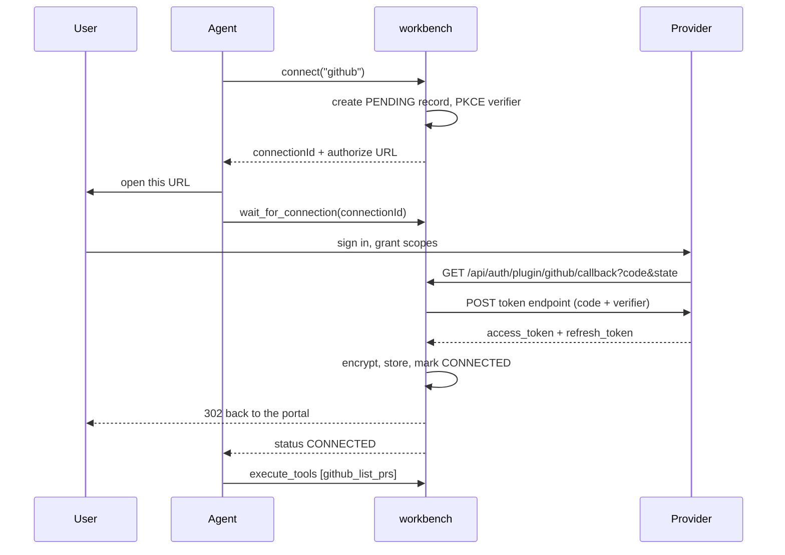

Every OAuth connection in workbench is **per user, per integration**. There is one row
in `connections` keyed on that pair, holding an encrypted access token and refresh
token. Connecting GitHub connects *your* GitHub, not the server's.

There are two vocabularies here and it is worth keeping them apart:

| Term | Direction | Managed by |
|---|---|---|
| **Connection** | workbench → a SaaS provider (GitHub, Jira, Slack) | `connect`, the portal, `/api/connections` |
| **Agent** | an MCP client → your workbench account | OAuth 2.1 at `/authorize`, `/api/agents` |

This page covers both, in that order.

## Starting a connection from the agent

`connect` takes one integration name and returns a URL for the user to open.

```json
{"jsonrpc":"2.0","id":1,"method":"tools/call","params":{
  "name": "connect", "arguments": { "integration": "github" }
}}
```

```json
{ "connectionId": "6f0e…-…", "type": "oauth2",
  "url": "https://github.com/login/oauth/authorize?client_id=…&state=…&code_challenge=…" }
```

`get_auth_url` is a deprecated alias with the identical handler — prefer `connect`.

Error returns, all as a normal result object:

| Response | Meaning |
|---|---|
| `{"error":"Integration not found"}` | Not in the registry |
| `{"error":"<name> is built-in and always connected — no connect needed."}` | `auth.type: "none"` (`browser`, `jots`) |
| `{"error":"<provider message>"}` | Usually missing client credentials on the server |

> [!NOTE] `connect` has no API-key branch
> An `apikey` integration falls into the OAuth path and errors out. API-key
> integrations are connected from the portal — see
> [API-key connections](api-key-connections.md).

Starting a connect also creates a **pending record**: an in-process entry with status
`PENDING`, a `connectionId`, and an expiry of `CONNECT_TTL_SECONDS` (default 600). This
record is what `wait_for_connection` polls. It is held in memory, not the database.

## Waiting for it to complete

```json
{"jsonrpc":"2.0","id":2,"method":"tools/call","params":{
  "name": "wait_for_connection",
  "arguments": { "connectionId": "6f0e…-…", "timeoutSec": 300 }
}}
```

`timeoutSec` is optional — a positive integer, maximum 900, default 300. The handler
polls once per second and returns one of:

| Result | Meaning |
|---|---|
| `{"status":"CONNECTED"}` | The callback landed and the token is stored |
| `{"status":"EXPIRED"}` | The pending record passed `CONNECT_TTL_SECONDS` |
| `{"status":"TIMEOUT"}` | Your `timeoutSec` elapsed first; the record is reaped to `EXPIRED` and cannot be revived — call `connect()` again |
| `{"error":"Unknown connectionId"}` | No such record — **or** it belongs to another user |

That last row is deliberate: a record owned by someone else returns the identical shape
as one that does not exist, so the endpoint is not an existence oracle.



## What actually marks a connection CONNECTED

The provider redirects to `GET /api/auth/plugin/<integration>/callback` — note the
`/plugin/` segment; it exists so provider callbacks cannot collide with the portal's own
SSO callback. The handler validates the single-use `state`, exchanges the code (with the
PKCE verifier held server-side), stores the tokens, and flips the pending record.

Two details worth knowing:

- **PKCE is used on every plugin OAuth flow**, confidential clients included. The
  verifier lives in `pending_auth`, never in the browser.
- The pending record is flipped by `(userId, integration)`, not by `connectionId` — the
  callback does not carry one. If a user starts two connects for the same integration,
  the newest pending record wins.

After the callback the browser lands back on the portal at
`PORTAL_URL#connected=<integration>`.

Whether an integration reports connected afterwards is not a stored flag. It is
recomputed each time: `auth.type: "none"` is always connected, `cookie` requires at
least one unexpired cookie, and everything else requires a stored access token.

## Connecting from the portal instead

The portal path skips `connect` entirely. `GET /api/auth/:integration` returns a
type-tagged response, and the portal acts on it — redirecting the browser for `oauth2`,
opening the API-key modal for `apikey`, opening the live login view for `cookie`.
Integrations declaring an `instance` block prompt for the instance URL first.

An `oauth2` integration whose client credentials are not configured on the server
returns **503** here, and shows as unconfigured in the integration list.

## Token storage

| Field | Encrypted at rest |
|---|---|
| `access_token` | yes — AES-256-GCM |
| `refresh_token` | yes — AES-256-GCM |
| `expires_at`, `scopes` | no |
| `config` (instance URL, region) | no |

The key is `ENCRYPTION_KEY`, 64 hex characters, read **once at module load**.

> [!DANGER] Changing `ENCRYPTION_KEY` orphans every stored credential
> There is no re-encryption path. Rotating the key requires a restart and makes every
> existing token and cookie bundle undecryptable — every user reconnects every
> integration. Back it up with the same care as the database.

## Refresh and rotation

Refresh is **lazy and on use**. There is no background job. When a tool call or a
proxied request asks for the token, the context checks whether it expires within 30
seconds; if so it posts `grant_type=refresh_token` to the provider's token endpoint,
recomputes the expiry, and re-stores.

- If the provider does not return a new refresh token, the old one is kept.
- If nothing was stored to refresh with, the call fails with
  `Token expired and no refresh_token stored`. The fix is to reconnect — and usually to
  add the provider's offline-access scope so a refresh token is issued at all.
- The re-store uses `COALESCE` on `config`, so a refresh never wipes a connection's
  instance URL or region.

## Disconnecting

From the portal, the Disconnect button on the integration. Over HTTP:

```bash
curl -X DELETE https://workbench.example.com/api/connections/github \
  -H "x-workbench-api-key: $KEY"
# {"success":true}
```

| Response | Cause |
|---|---|
| `{"success":true}` | The row was deleted |
| 404 | Unknown integration |
| 400 `Built-in integration cannot be disconnected` | `auth.type: "none"` |

This deletes the local row and nothing else. **No provider-side revocation is
attempted** — the token may remain valid at the provider until it expires or the user
revokes the app there. For a full revoke, remove the authorization in the provider's own
account settings as well.

> [!NOTE] `/api/*` does not accept an MCP OAuth access token
> These routes take a portal session JWT (`Authorization: Bearer`) or an API key
> (`x-workbench-api-key`). An OAuth access token authenticates `/mcp` only.

## Connected agents: which clients hold tokens on your account

Separate from provider connections is the list of **MCP clients** that have been
authorized against your workbench account through OAuth 2.1 — a Claude Code install, a
desktop client, anything that ran the `/authorize` flow. Each holds a rotating refresh
token good for 30 days.

The portal shows these in the agents panel. Over HTTP:

```bash
curl https://workbench.example.com/api/agents \
  -H "x-workbench-api-key: $KEY"
```

```json
{
  "agents": [
    {
      "client_id": "a1b2c3d4e5f60718",
      "client_name": "Claude Code",
      "scopes": ["mcp"],
      "connected_since": 1756400000,
      "expires_at": 1758992000
    }
  ]
}
```

Rows are grouped by `client_id` from live refresh tokens, so a client that has never
been authorized — or whose tokens have all expired — does not appear. `connected_since`
survives token rotation: the original creation time is carried forward each time the
refresh token is exchanged.

To revoke one:

```bash
curl -X DELETE https://workbench.example.com/api/agents/a1b2c3d4e5f60718 \
  -H "x-workbench-api-key: $KEY"
# {"revoked": 1}
```

This deletes that client's refresh tokens and any outstanding authorization codes for
your user. It is idempotent — revoking twice returns `{"revoked": 0}`.

> [!WARNING] Revocation is soft: existing access tokens survive until they expire
> Access tokens are self-contained JWTs and are not checked against a revocation list.
> A client holding a live one keeps working until it lapses — up to
> `OAUTH_ACCESS_TOKEN_TTL_SECONDS`, default one hour. It just cannot mint another
> afterwards. If you need an immediate cutoff, rotating `SESSION_SECRET` invalidates
> every issued token at once, including portal sessions.

Revoking an agent does not touch your provider connections. The client loses access to
your workbench; your GitHub and Jira tokens stay stored.
