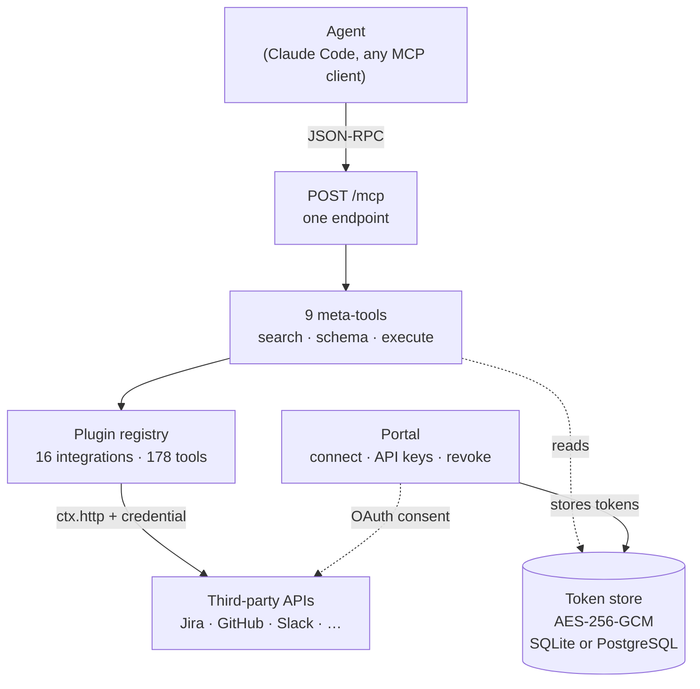

workbench is a self-hosted MCP server that sits between your agent and the SaaS
tools it needs. It ships 16 integrations and 178 tools, holds a separate OAuth
connection per user per provider, and exposes all of it through **9 meta-tools** —
so the agent's tool list stays the same size whether you have loaded one
integration or all of them.

The alternative is running one MCP server per service: sixteen processes, sixteen
credential setups, and every tool from every one of them flattened into the
agent's context on connect.

## The shape of it

The agent never holds a provider credential. It names a tool; the server looks up
that user's stored token, injects it into the outbound request, and returns the
response.

## Why the meta-tool pattern

A conventional MCP server advertises every tool it has in `tools/list`. Connect
five of them and the agent is carrying several hundred tool definitions before it
has done any work — context spent on descriptions it will not use, and a harder
selection problem when it picks one.

workbench advertises only the 9 meta-tools. Everything else is reached by name:

1. `search_tools` finds candidates by keyword.
2. `get_tool_schema` returns the JSON Schema for one tool's arguments.
3. `execute_tools` runs one or many, concurrently, in a single call.

The same discipline applies on the way back. A tool result is serialized into one
text block capped at **60,000 characters**; past that it is truncated with a notice
telling the agent to narrow the request with `limit`, `fields`, or pagination.
Truncated output is deliberately not valid JSON, so a client cannot silently parse
a half-response as complete.

## Where to go next

:::cards 3
- [Quickstart](start/quickstart.md) — Local server, API key, connected agent, one pass.
- [How it works](start/how-it-works.md) — Packages, request path, where tokens live.
- [Core concepts](start/concepts.md) — Integration, plugin, tool, connection, registry.
- [Integrations](integrations/index.md) — All 16, their scopes and their tools.
- [Build plugins](plugins/index.md) — The manifest, the context API, the four auth modes.
- [Deploy](deploy/install.md) — Docker, Postgres, SSO, security, observability.
:::

## At a glance

| | |
|---|---|
| Integrations | 16 on disk, plus 2 internal (`browser`, `jots`) |
| Tools | 178 plugin tools, behind 9 meta-tools |
| Auth modes | `oauth2`, `apikey`, `cookie`, `none` |
| Agent auth | Workbench API key, OAuth 2.1 (DCR + PKCE), or portal session |
| Portal login | Google, Keycloak, or both (the agent OAuth flow is Google-only) |
| Database | SQLite or PostgreSQL |
| Deployment | Node 20+, Docker image, Docker Compose |
