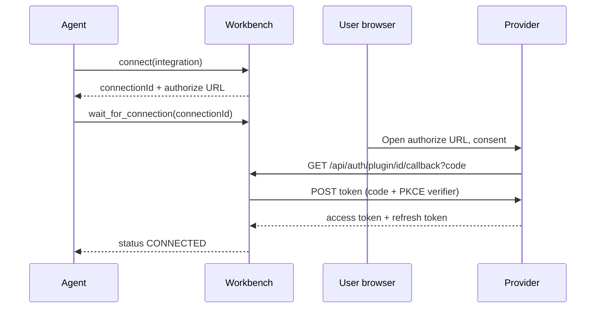

An integration is a plugin: a manifest that declares how to authenticate, plus a set of tools your agent can call. A stock install loads **16 plugins from disk (194 tools)**. It adds **two internal plugins built into the server**: `browser` (9 tools) and `jots` (5 tools). That is 208 tools behind one MCP endpoint. An agent reaches them through `execute_tools` rather than a list: `tools/list` on `/mcp` returns only the 9 meta-tools.

Credentials are per user. As the operator, you register one OAuth app per integration. Each user then grants their own access. The server stores each user's tokens encrypted against their own account.

## Every shipped integration

| Integration | Auth | Tools | Page |
|---|---|---|---|
| `atlassian-jira` | OAuth 2.0 (3LO) | 12 | [Jira](atlassian-jira.md) |
| `atlassian-confluence` | OAuth 2.0 (3LO) | 6 | [Confluence](atlassian-confluence.md) |
| `atlassian-bitbucket` | OAuth 2.0 | 20 | [Bitbucket](atlassian-bitbucket.md) |
| `github` | OAuth 2.0 | 28 | [GitHub](github.md) |
| `gitlab` | OAuth 2.0 (+ instance) | 31 | [GitLab](gitlab.md) |
| `slack` | OAuth 2.0 (user token) | 18 | [Slack](slack.md) |
| `asana` | OAuth 2.0 | 8 | [Asana](asana.md) |
| `newrelic` | API key | 13 | [New Relic](newrelic.md) |
| `clevertap` | API key (multi-project) | 19 | [CleverTap](clevertap.md) |
| `google-gmail` | OAuth 2.0 | 8 | [Google tools](google-tools.md) |
| `google-drive` | OAuth 2.0 | 8 | [Google tools](google-tools.md) |
| `google-docs` | OAuth 2.0 | 5 | [Google tools](google-tools.md) |
| `google-sheets` | OAuth 2.0 | 5 | [Google tools](google-tools.md) |
| `google-slides` | OAuth 2.0 | 5 | [Google tools](google-tools.md) |
| `google-calendar` | OAuth 2.0 | 7 | [Google tools](google-tools.md) |
| `google-gemini` | OAuth 2.0 | 1 | [Google tools](google-tools.md) |
| `httpbin-cookie` | Cookie | 3 | — (cookie-auth reference plugin) |
| `browser` | None (internal) | 9 | [Browser](browser.md) |
| `jots` | None (internal) | 3 | [Jots](jots.md) |

`httpbin-cookie` is a demo plugin that exercises the cookie-auth path against `httpbin.org`. It ships with no logo on purpose, to exercise the portal's fallback icon.

:::cards 2
- [Jira](atlassian-jira.md) — Issues, JQL search, transitions, comments, boards.
- [Confluence](atlassian-confluence.md) — Pages and spaces on the Confluence REST v2 API.
- [Bitbucket](atlassian-bitbucket.md) — Repos, the full pull-request review loop, and Pipelines.
- [GitHub](github.md) — Repos, issues, pull requests, reviews, and Actions.
- [GitLab](gitlab.md) — Projects, merge requests, and CI, on gitlab.com or self-hosted.
- [Slack](slack.md) — Messages, channels, search, and files, as the connecting user.
- [Asana](asana.md) — Projects, tasks, assignments, and comments.
- [New Relic](newrelic.md) — NRQL, entities, dashboards, and alerting via NerdGraph.
- [CleverTap](clevertap.md) — Profiles, events, campaigns, and reports (read-only, multi-project).
- [Google setup](google.md) — One Cloud project, one consent screen, seven OAuth clients.
- [Google tools](google-tools.md) — Gmail, Drive, Docs, Sheets, Slides, Calendar, Gemini.
- [Browser](browser.md) — The built-in headless browser your agent drives directly.
- [Jots](jots.md) — Built-in static hosting for artifacts the agent produces.
:::

## How connecting works

Connecting is a per-user OAuth handshake that the agent starts and the user finishes in a browser. The agent never sees the provider credential — it only learns that the connection completed.



`connect` creates a pending record whose TTL is `CONNECT_TTL_SECONDS` (default 600). `wait_for_connection` polls once a second. It returns `{ status }` of `CONNECTED`, `TIMEOUT`, or `EXPIRED`. Its `timeoutSec` defaults to 300 and caps at 900. A fourth outcome needs handling: an id that does not exist returns `{ error: "Unknown connectionId" }` immediately. An id that belongs to another user returns that same shape, so it cannot be used as an existence oracle. Users who prefer the UI can skip both and press **Connect** on the portal's Connections page.

Tokens land in the `connections` table encrypted with AES-256-GCM, one row per user per integration. Refresh happens lazily: the next tool call that finds the access token within 30 seconds of expiry refreshes it first. There is no background refresh job. An integration whose provider issued no refresh token fails on first use after expiry. It does not reconnect on its own.

## Shared conventions

### Callback URL

Every OAuth plugin uses the same generic callback route:

```
${SERVER_PUBLIC_URL}/api/auth/plugin/<integration-id>/callback
```

The `/plugin/` segment is not optional — it exists so plugin callbacks never collide with the portal's own `/api/auth/google/callback` SSO route.

> [!WARNING] The single most common setup failure
> A callback registered as `/api/auth/github/callback` (no `/plugin/`) fails with a `redirect_uri` mismatch at consent time. Use the integration's full id, exactly as it appears in the table above: `atlassian-jira`, not `jira`, and `google-gmail`, not `google`.

### Where client credentials come from

Client id and secret are read straight from the environment. The variable prefix is the plugin's own name, kebab-case converted to `UPPER_SNAKE_CASE`:

| Plugin | Variables |
|---|---|
| `github` | `GITHUB_CLIENT_ID` / `GITHUB_CLIENT_SECRET` |
| `atlassian-jira` | `ATLASSIAN_JIRA_CLIENT_ID` / `ATLASSIAN_JIRA_CLIENT_SECRET` |
| `google-gmail` | `GOOGLE_GMAIL_CLIENT_ID` / `GOOGLE_GMAIL_CLIENT_SECRET` |

There is **no fallback and no sharing**. `atlassian-jira` and `atlassian-confluence` read separate variables, even if you point them at the same Atlassian app. `GOOGLE_CLIENT_ID` is portal SSO only, and no `google-*` plugin ever uses it. A plugin whose `_CLIENT_ID` is unset shows as `Not configured` in the portal. Its card reads `Auth not configured`, renders no Connect button, and is not clickable.

An unset or empty `_CLIENT_SECRET` is not an error: the server then treats the integration as a public client and runs PKCE only. PKCE runs on every flow regardless, confidential clients included, with the verifier held server-side.

### Scope hygiene

Scopes live in the plugin manifest and are sent verbatim in the authorize request. When you change them:

1. Update the manifest.
2. Add the matching permission in the provider's console.
3. Have every connected user disconnect and reconnect.

A refresh token never upgrades its own scope grant. Adding a scope to a manifest without a reconnect produces 401s or `missing_scope` on exactly the new tools. Every tool that worked before keeps working, which is what makes this hard to diagnose.

### Raw API access

Fifteen of the sixteen on-disk plugins declare a `proxy` base. That makes them eligible for `curl_session`, a short-lived token. It lets an agent make arbitrary authenticated calls against the provider through `/c/<integration>/<path>`. The server injects the credential and never hands it to the agent. This is a high-risk escape hatch, not a normal path. See [Raw API calls](../guides/curl-session.md).
