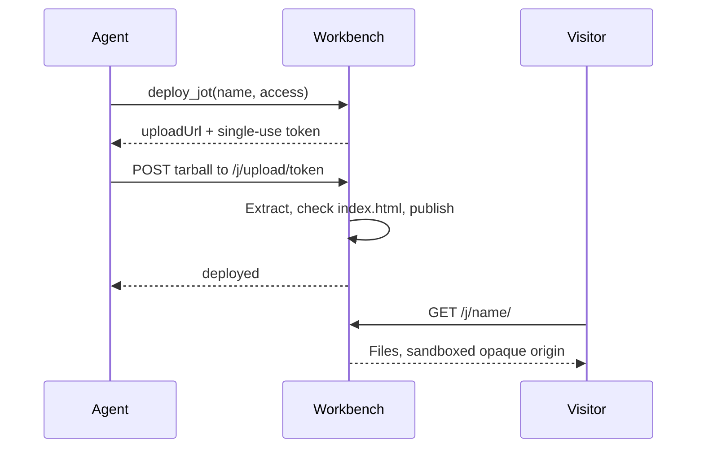

`jots` gives an agent somewhere to put a finished artifact. Package a directory as a gzip tarball and upload it. The server serves it at `/j/<name>/`. It can be a report, a chart, a small tool, or anything else that is a self-contained static site.

Like `browser`, it is an internal plugin: server source rather than `PLUGINS_DIR`, `auth: { type: "none" }`, always connected, no setup. Its handlers touch the jots filesystem directly, which is exactly the capability a third-party plugin must not have. The name `jots` is reserved at load time.

## At a glance

| | |
|---|---|
| Plugin id | `jots` |
| Auth | None (internal, always connected) |
| Tools | 5 |
| Served at | `${SERVER_PUBLIC_URL}/j/<name>/` |

## Tools

| Tool | Purpose |
|---|---|
| `deploy_jot` | Start a deploy; returns an upload URL and a single-use token |
| `update_jot` | Start a **partial** update; the archive is overlaid onto the live jot |
| `list_jot_files` | List the files inside a jot you own — path, bytes, updated time |
| `list_jots` | List the jots you deployed — name, access, URL, updated time |
| `delete_jot` | Delete a jot you own by name |

Every tool is scoped to the caller. `list_jots` returns only your own jots. `update_jot`, `list_jot_files`, and `delete_jot` return `FORBIDDEN` for another owner's jot, and `NOT_FOUND` for a name that does not exist.

## Deploy, upload, serve



`deploy_jot` mints a token and returns `{ uploadUrl, token, expiresAt, maxBytes }`. Nothing is stored yet. The upload itself is a raw gzip body:

```bash
tar czf - -C <dir> . | curl --data-binary @- \
  -H 'Content-Type: application/gzip' <uploadUrl>
```

The server extracts the archive to a temporary directory and enforces the limits during extraction. It requires a root `index.html`. Only then does it publish, replacing any previous deploy of that name wholesale. A failed upload leaves the existing jot untouched.

## Partial updates

`update_jot` mints the same kind of token in **patch** mode. The server stages a copy of the live tree, applies the token's `delete` list, then overlays the uploaded archive on top. A path that is both deleted and uploaded keeps the uploaded version. Files you never mention survive.

```bash
tar czf - -C <dir> data.json | curl --data-binary @- \
  -H 'Content-Type: application/gzip' <uploadUrl>
```

The archive needs no root `index.html`. The live one is retained. Call `list_jot_files` first to see what a jot currently holds.

A patch reads `access` and the password hash from the live manifest rather than from the token. An update therefore can never change a jot's gating. Redeploy for that. The server checks ownership again when the upload lands. A jot deleted or reassigned between mint and upload returns 404 or 403.

The **merged** tree is re-measured against both limits. Extraction only sees the incoming archive, so without that second check a run of patches could walk a jot past `JOTS_MAX_BYTES` or `JOTS_MAX_FILES`. An overflowing patch returns 413 and leaves the live jot untouched.

## Limits

| Limit | Default | Env var |
|---|---|---|
| Decompressed archive size | 5 MiB | `JOTS_MAX_BYTES` |
| File count | 1000 | `JOTS_MAX_FILES` |
| Upload token lifetime | 300 seconds | `JOTS_UPLOAD_TTL_SECONDS` |

The upload token is single-use as well as short-lived: consuming it deploys, and a second POST with the same token gets a 404. An archive that exceeds size or file count is rejected with `TOO_LARGE` or `TOO_MANY_FILES` (HTTP 413). One with no root `index.html` is rejected with `NO_INDEX` (HTTP 400).

## Names, ownership, and access

Names are **global and creator-locked**. A name is lowercase alphanumerics and hyphens, must start with an alphanumeric, and is at most 64 characters. The first user to deploy a name owns it. Anyone else deploying that name gets `JOT_NAME_TAKEN`. There is no per-user namespace — `/j/report/` is one jot for the whole deployment.

`access` is `public` or `password`. A password jot requires a `password` at deploy time, and omitting it returns `PASSWORD_REQUIRED`. The server hashes the password before it mints the token, and never stores the plaintext. Visitors get an unlock form. A correct password sets an HttpOnly cookie scoped to `/j/<name>/` that lasts 30 days.

> [!WARNING] Password protection is a gate, not a secret store
> Anyone with the password can read the jot, the name is guessable, and there is no rate limiting on the unlock form. Do not deploy credentials, personal data, or anything whose exposure matters.

## Sandboxed serving

Every jot response carries `Content-Security-Policy: sandbox allow-scripts allow-forms`, plus `nosniff`, `X-Frame-Options: SAMEORIGIN`, and `Cross-Origin-Resource-Policy: same-origin`.

The `sandbox` directive forces the browser to treat the page as a unique **opaque origin**. Jot JavaScript therefore cannot read the app's cookies or storage, and cannot make credentialed same-origin requests to `/api` or `/mcp`. Uploaded content is untrusted by construction, and this is what keeps it from reaching the rest of the deployment.

> [!WARNING] By default, a jot cannot fetch its own files
> An opaque origin is cross-origin to itself, so `fetch('./data.json')` from inside a jot fails. Jots must be self-contained. Inline the data, the CSS, and the scripts into the page rather than loading them at runtime, unless you opt into `cors` below.

`allow-scripts` and `allow-forms` are kept so ordinary interactive pages and the unlock form still work.

### Opting into cross-origin reads

`deploy_jot` and `update_jot` both accept `cors: true`, stored on the jot's manifest. On a **public** jot, the server sends `Access-Control-Allow-Origin: *` and `Cross-Origin-Resource-Policy: cross-origin`, and answers preflight `OPTIONS` requests. That is what lets a page fetch its own JSON. It pairs with `update_jot`: ship the page once, then patch the data file on its own schedule.

The sandbox is untouched. `sandbox allow-scripts allow-forms`, `nosniff`, and `X-Frame-Options` are still sent, so the page still cannot reach app cookies, storage, `/api`, or `/mcp`.

The trade is that any site can then read that jot's files. Public jot content is already readable over a plain GET. This only matters if an unguessable name was doing security work it was never able to do.

On a password jot the flag is ignored — an opaque-origin fetch sends no cookie, so the request would 401 anyway. A preflight to a jot without `cors` returns 404, so CORS posture is not discoverable by probing.

## Notes and gotchas

The manifest file `jot.json` is blocked on both upload and serve. The guards compare the final path segment, so `jot.json` and `a/b/jot.json` are both refused. A request for it returns 404 rather than 403, so the server does not confirm it exists.

Path traversal is rejected on both sides. An archive entry that escapes the root is refused at extraction. A serve path that resolves outside the jot directory returns 403.

Each **deploy** replaces the whole jot, and there is no rollback. `update_jot` covers the incremental case. Anything else means re-uploading the complete directory.
