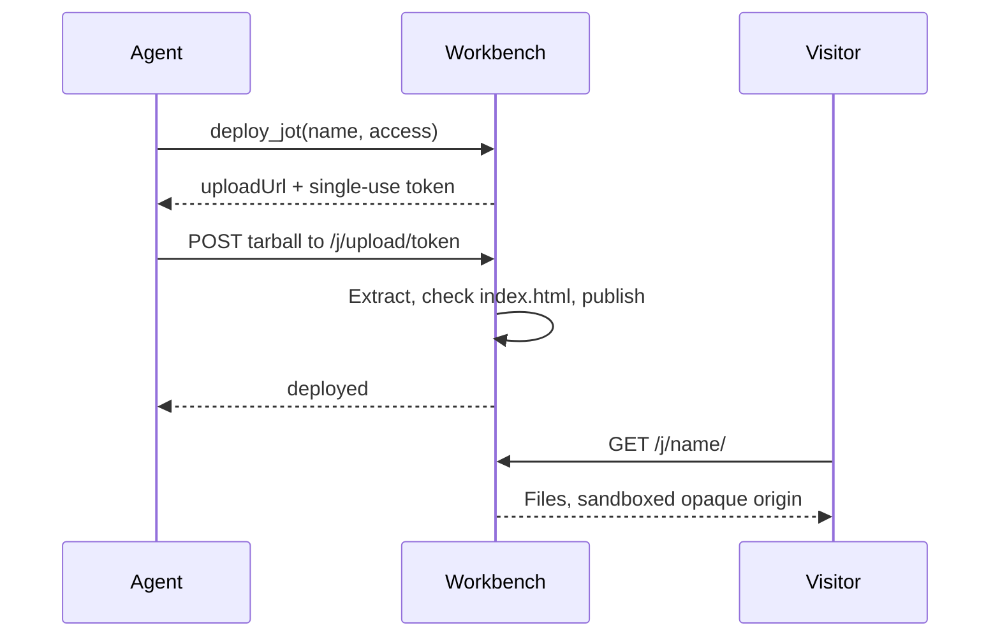

`jots` gives an agent somewhere to put a finished artifact. Package a directory as a gzip tarball, upload it, and it is served at `/j/<name>/` — a report, a chart, a small tool, anything that is a self-contained static site.

Like `browser`, it is an internal plugin: server source rather than `PLUGINS_DIR`, `auth: { type: "none" }`, always connected, no setup. Its handlers touch the jots filesystem directly, which is exactly the capability a third-party plugin must not have. The name `jots` is reserved at load time.

## At a glance

| | |
|---|---|
| Plugin id | `jots` |
| Auth | None (internal, always connected) |
| Tools | 3 |
| Served at | `${SERVER_PUBLIC_URL}/j/<name>/` |

## Tools

| Tool | Purpose |
|---|---|
| `deploy_jot` | Start a deploy; returns an upload URL and a single-use token |
| `list_jots` | List the jots you deployed — name, access, URL, updated time |
| `delete_jot` | Delete a jot you own by name |

`list_jots` returns only the caller's own jots. `delete_jot` is ownership-checked: another owner's jot returns `FORBIDDEN`, a name that does not exist returns `NOT_FOUND`.

## Deploy, upload, serve



`deploy_jot` mints a token and returns `{ uploadUrl, token, expiresAt, maxBytes }`. Nothing is stored yet. The upload itself is a raw gzip body:

```bash
tar czf - -C <dir> . | curl --data-binary @- \
  -H 'Content-Type: application/gzip' <uploadUrl>
```

The server extracts the archive to a temporary directory, enforces the limits during extraction, requires a root `index.html`, and only then publishes — replacing any previous deploy of that name wholesale. A failed upload leaves the existing jot untouched.

## Limits

| Limit | Default | Env var |
|---|---|---|
| Decompressed archive size | 5 MiB | `JOTS_MAX_BYTES` |
| File count | 1000 | `JOTS_MAX_FILES` |
| Upload token lifetime | 300 seconds | `JOTS_UPLOAD_TTL_SECONDS` |

The upload token is single-use as well as short-lived: consuming it deploys, and a second POST with the same token gets a 404. An archive that exceeds size or file count is rejected with `TOO_LARGE` or `TOO_MANY_FILES` (HTTP 413); one with no root `index.html` is rejected with `NO_INDEX` (HTTP 400).

## Names, ownership, and access

Names are **global and creator-locked**. A name is lowercase alphanumerics and hyphens, must start with an alphanumeric, and is at most 64 characters. The first user to deploy a name owns it; anyone else deploying that name gets `JOT_NAME_TAKEN`. There is no per-user namespace — `/j/report/` is one jot for the whole deployment.

`access` is `public` or `password`. A password jot requires a `password` at deploy time — omitting it returns `PASSWORD_REQUIRED` — and the password is hashed before the token is minted; the plaintext is never stored. Visitors get an unlock form, and a correct password sets an HttpOnly cookie scoped to `/j/<name>/` that lasts 30 days.

> [!WARNING] Password protection is a gate, not a secret store
> Anyone with the password can read the jot, the name is guessable, and there is no rate limiting on the unlock form. Do not deploy credentials, personal data, or anything whose exposure matters.

## Sandboxed serving

Every jot response carries `Content-Security-Policy: sandbox allow-scripts allow-forms`, plus `nosniff`, `X-Frame-Options: SAMEORIGIN`, and `Cross-Origin-Resource-Policy: same-origin`.

The `sandbox` directive forces the browser to treat the page as a unique **opaque origin**. Jot JavaScript therefore cannot read the app's cookies or storage, and cannot make credentialed same-origin requests to `/api` or `/mcp`. Uploaded content is untrusted by construction, and this is what keeps it from reaching the rest of the deployment.

> [!WARNING] A jot cannot fetch its own files
> An opaque origin is cross-origin to itself, so `fetch('./data.json')` from inside a jot fails. Jots must be self-contained: inline the data, the CSS, and the scripts into the page rather than loading them at runtime.

`allow-scripts` and `allow-forms` are kept so ordinary interactive pages and the unlock form still work.

## Notes and gotchas

The manifest file `jot.json` is blocked on both upload and serve — the guards compare the final path segment, so `jot.json` and `a/b/jot.json` are both refused — and a request for it returns 404 rather than 403 — the server does not confirm it exists.

Path traversal is rejected on both sides: an archive entry that escapes the root is refused at extraction, and a serve path that resolves outside the jot directory returns 403.

Each deploy replaces the whole jot. There is no incremental upload and no rollback, so re-upload the complete directory every time.
