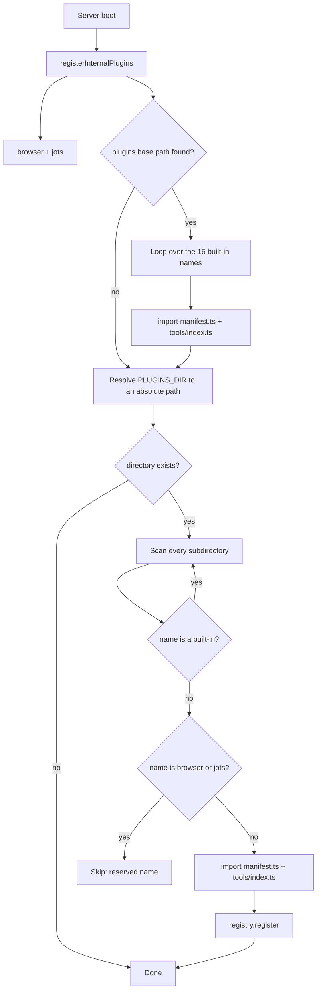

A plugin adds an integration to your workbench: a name, an auth method, and a set
of tools an agent can call. The 16 shipped integrations are plugins, and yours
loads through exactly the same path — no fork, no PR, no rebuild.

## The two-file contract

A plugin on disk is a directory with two import targets. Both filenames are
hardcoded in the loader:

```
my-internal-tool/          ← directory name must equal manifest.name
├── manifest.ts            ← default-exports an Integration object
├── logo.svg               ← optional, referenced by manifest.logo
└── tools/
    └── index.ts           ← exports one object per tool
```

`manifest.ts` default-exports an `Integration` — the identity, the auth method,
the portal presentation, and optionally the curl-proxy base URL. See the
[manifest reference](manifest.md).

`tools/index.ts` exports tool objects. The loader inspects **every** export of
that module and keeps the ones that look like a tool: an object with a `name`, a
`handler` function, and an `inputSchema` that is a Zod schema. Re-export barrels
work, which is how the Google plugins are laid out
(`export { … } from "./gmail"`).

```ts
export const search = {
  name: "internal_search",
  description: "Full-text search the internal knowledge base",
  integration: "my-internal-tool",
  inputSchema: z.object({ query: z.string() }),
  handler: async (ctx: any, args: any) => {
    const res = await ctx.http(`https://internal.example.com/api/search?q=${args.query}`);
    return res.json();
  },
};
```

The handler receives a `ToolContext` — four members, and no more. It carries the
user id, the decrypted token, an authenticated `fetch`, and the per-connection
config. See the [context reference](context.md).

## Where plugins live

There are two kinds of location, and they are equivalent at runtime — same
registration call, same auth injection, same MCP exposure. The difference is
purely deployment.

| Kind | Location | Ships with |
|---|---|---|
| Built-in | `packages/plugins/<name>/` | The repo and the Docker image |
| External | `$PLUGINS_DIR/<name>/` | Whatever you bind-mount at runtime |

Two names are reserved: `browser` and `jots` are internal plugins registered from
server source, and a disk directory using either name is refused.

## How the server finds them

`loadPlugins()` runs once at boot. Internal plugins first, then the built-ins by
a hardcoded list, then everything in `PLUGINS_DIR`.



Each import is individually try/caught, so a plugin that throws on import is
absent from the catalog rather than fatal to the server. Registration overwrites
by name — for integrations and for tools, which share one flat global namespace.
Details and the failure modes are in [loading and reloading](loading.md).

## Where to go next

:::cards 2
- [Write your first plugin](writing-a-plugin.md) — Build a complete working plugin from nothing, load it, connect it, and call it from an agent.
- [Manifest reference](manifest.md) — Every field of the `Integration` interface, including `proxy` and the self-hosted `instance` block.
- [Plugin context API](context.md) — `userId`, `getToken()`, `http()`, `getConfig()`, and the host-guard rules you must not rely on.
- [Auth modes](auth-modes.md) — `oauth2`, `apikey`, `cookie`, `none`: when to use each and the exact manifest shape.
- [Loading and reloading](loading.md) — Discovery order, skip rules, `PLUGINS_DIR`, and mounting a plugin directory in Docker or Kubernetes.
:::
