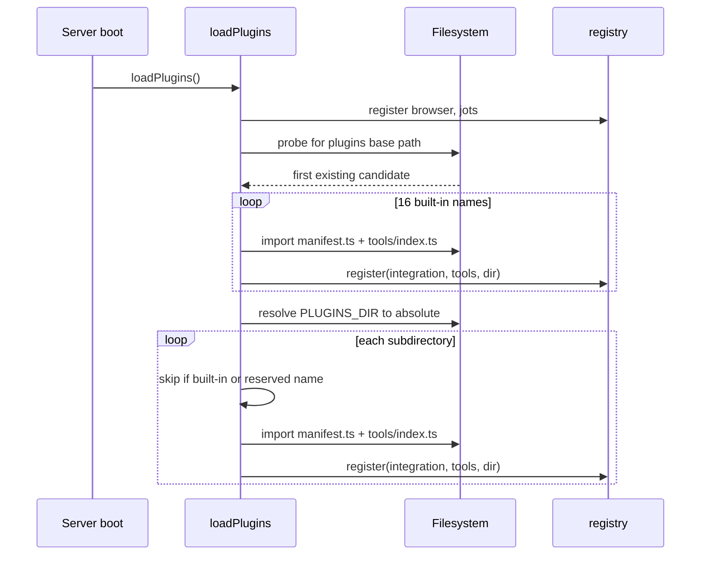

`loadPlugins()` runs exactly once, during server boot. It registers internal
plugins, then built-ins, then everything found under `PLUGINS_DIR`.



## Step 1 — internal plugins

`registerInternalPlugins()` registers `browser` and `jots` from server source.
Both declare `auth: { type: "none" }`. They are not on disk under `PLUGINS_DIR`
and cannot be replaced: their handlers reach into the browser-session and jots
modules, capabilities deliberately kept out of the plugin `ToolContext` so a
third-party plugin can never drive a user's logged-in capture browser or touch
the jots filesystem.

## Step 2 — built-ins by hardcoded list

There is no directory scan for built-ins. The loader iterates a literal array of
16 names:

```
google-gmail        atlassian-jira          asana
google-drive        atlassian-confluence    github
google-sheets       atlassian-bitbucket     gitlab
google-calendar                             slack
google-gemini                               newrelic
google-docs                                 httpbin-cookie
google-slides
```

Adding a directory under `packages/plugins/` without adding its name to that
array skips it here — but whether it is loaded at all depends on where
`PLUGINS_DIR` points:

- **In the shipped container image, it is still loaded.** `packages/plugins` is
  copied to `/app/plugins`, which is both the base path found by the probe below
  and where the default `PLUGINS_DIR` (`./plugins`, resolved against the
  `/app` workdir) lands. Step 3 scans that same directory and imports every
  subdirectory that is not a built-in name, so an unlisted directory loads there
  and logs `Loaded plugin: <dir>`.
- **In a dev layout, it does nothing.** Dev runs from `packages/server`, so
  `./plugins` resolves to `packages/server/plugins`, which does not exist —
  step 3 returns immediately and nothing outside the array is loaded.

The base directory is probed in order, and the first one that exists wins:

| Order | Candidate, relative to `process.cwd()` |
|---|---|
| 1 | `../plugins` |
| 2 | `../../plugins` |
| 3 | `plugins` |

If none exists, the entire built-in step is skipped and boot continues.

## Step 3 — external plugins from `PLUGINS_DIR`

| Variable | Default | Required |
|---|---|---|
| `PLUGINS_DIR` | `./plugins` | No |

The value is **always** passed through `path.resolve()` before use. If the
directory does not exist, the step returns silently. Otherwise every direct
subdirectory is scanned and imported.

> [!WARNING] Why the path is resolved to absolute
> A relative directory reaches `import()` as a bare specifier. Node's ESM
> resolver reads `plugins/slack/manifest.ts` as the package `plugins` and throws
> `ERR_MODULE_NOT_FOUND` — which, with the default `./plugins`, failed every
> plugin at once on container boot. `path.resolve()` is what prevents it. Do not
> reintroduce a relative path anywhere in this chain.

### Two skip rules

**Built-in names are skipped.** In the shipped container image `PLUGINS_DIR` and
the built-in base path resolve to the same directory (`/app/plugins`), so every
built-in would otherwise be imported twice. The built-in loop already registered
them. Note the corollary: in that image this step scans the built-in directory
itself, so any *other* directory sitting there is loaded even though it is not on
the built-in list.

**`browser` and `jots` are refused.** Registration overwrites by name, so a disk
directory using either name would shadow an internal capability. The loader logs
and continues:

```
Skipping plugin dir "browser": name reserved for internal plugin
```

## Failure isolation

Every import — built-in and external — is individually wrapped in try/catch.

| Failure | Log line | Effect |
|---|---|---|
| Built-in plugin throws | `Failed to load built-in plugin <name>: …` | That integration is absent; boot continues |
| External plugin throws | `Failed to load plugin <dir>: …` | That integration is absent; boot continues |
| Success (external) | `Loaded plugin: <dir>` | Registered |

The important consequence: **a broken plugin is silently missing, not fatal.**
The server starts, the portal renders, and the integration simply is not in the
catalog. When a plugin you expect does not appear, read the boot log first — a
missing card almost always has a `Failed to load` line above it.

## Registration overwrites by name

The registry holds two maps: integrations keyed by `integration.name`, and tools
keyed by `tool.name`. `register()` writes into both with plain `set` — no
collision check, no warning.

- **Integration names.** A later plugin with the same `name` replaces the earlier
  one entirely, including its tools list and directory.
- **Tool names are one flat global namespace.** They are keyed across all
  plugins, not scoped per integration. If your plugin exports a tool named
  `github_list_repos`, whichever plugin registers last wins — and since external
  plugins load *after* built-ins, yours would win, silently breaking GitHub.

Prefix every tool name with your integration's identity, and keep the prefix
distinct from the 16 shipped ones.

## There is no hot reload

Plugins are imported once at boot. `import()` results are cached by the ESM
loader, so even re-running `loadPlugins()` would not pick up edits on disk.

**Restart the server after any change to a plugin file** — the manifest, a tool,
or a re-export barrel.

```bash
docker compose restart workbench
```

## Mounting a plugin directory

### Docker Compose

The image ships only the built-ins. Bind-mount your plugin tree read-only and
point `PLUGINS_DIR` at the mount:

```yaml
services:
  workbench:
    image: workbench:latest
    volumes:
      - /srv/awb-plugins:/srv/awb-plugins:ro
    environment:
      - PLUGINS_DIR=/srv/awb-plugins
      - MY_INTERNAL_TOOL_CLIENT_ID=...
      - MY_INTERNAL_TOOL_CLIENT_SECRET=...
```

`:ro` keeps the server from ever mutating your plugin tree.

### Kubernetes

The same shape: mount something at `PLUGINS_DIR`. A `ConfigMap` works for a small
plugin; a `PersistentVolumeClaim` is better once you ship a logo or several tool
files. OAuth credentials belong in a `Secret`, not the ConfigMap.

```yaml
spec:
  containers:
    - name: workbench
      env:
        - name: PLUGINS_DIR
          value: /srv/awb-plugins
        - name: MY_INTERNAL_TOOL_CLIENT_ID
          valueFrom:
            secretKeyRef: { name: awb-plugin-oauth, key: client-id }
      volumeMounts:
        - name: plugins
          mountPath: /srv/awb-plugins
          readOnly: true
  volumes:
    - name: plugins
      persistentVolumeClaim:
        claimName: awb-plugins
```

Because there is no hot reload, updating the volume contents requires a pod
restart to take effect.

## The `.ts` requirement

The loader imports `manifest.ts` and `tools/index.ts` by those exact filenames.
The server runtime must be able to resolve TypeScript — in this repo it runs under
`tsx`. If you ship pre-built JavaScript, the filenames the loader looks for do
not change, so a `.js`-only plugin will not load as-is.

## Verifying a load

:::steps

### Check the boot log
```
Loaded plugin: my-internal-tool
```

### Check the portal
The integration appears as a card with its logo (or a cog if `logo` is omitted)
and offers the connect flow for its auth type.

### Check MCP
```bash
curl -s -X POST $SERVER_PUBLIC_URL/mcp \
  -H "x-workbench-api-key: $API_KEY" \
  -H "Content-Type: application/json" \
  -d '{"jsonrpc":"2.0","id":1,"method":"tools/call",
       "params":{"name":"list_integrations","arguments":{}}}'
```
Your integration should be listed with its `version` and a `connected` flag.
Then `search_tools` for one of your tool names, and `execute_tools` to run it.

:::
