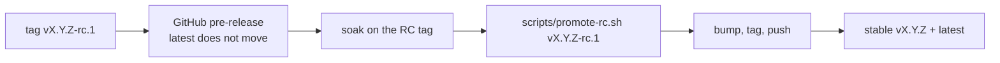

workbench is a TypeScript monorepo orchestrated with Turbo, and it is a **public
repository** — history is published too, so a leak in any commit is permanent. Read
the hygiene rules below before your first commit, not after.

## Setup

You need Node 20 or 22 — the two versions CI builds against — and npm 10. The
published Docker image is Node 20 only; both Dockerfile stages are
`node:20-bookworm-slim`.

```bash
git clone https://github.com/<your-fork>/workbench.git
cd workbench
git config core.hooksPath .githooks   # once per clone, see below
cp .env.example .env                  # fill in the required values
npm install
npm run dev
```

`npm run dev` fans out to every package that defines a `dev` script: the server under
`tsx watch` (loading `.env` from the repo root), the portal under Vite, and the sample
OAuth provider.

`.env` needs at minimum `ENCRYPTION_KEY` and `SESSION_SECRET`; see
[environment variables](environment.md) for how to generate them and what else you can
set.

To get a working account without configuring SSO:

```bash
cd packages/server
npx tsx --env-file=../../.env scripts/seed-local-user.ts   # default id "local-dev-user"
```

It prints an API key for the `x-workbench-api-key` header. Re-running rotates the key.

`packages/sample-oauth` is a throwaway OAuth provider wired into Compose on port 3002,
useful for exercising the OAuth path without registering a real app.

## Repository layout

```
packages/
  shared/   # shared types + schemas
  server/   # Fastify + MCP + auth + plugins
  portal/   # React connection-management UI
  plugins/  # built-in integrations (jira, slack, github, ...)
docs/
  findings/ # one discovery per file — see below
  releases/ # hand-written release notes, one per version
```

## Checks

Run all three before pushing. CI runs the same ones on every PR to `main`, across
Node 20 and 22, with a live `postgres:16` service.

```bash
npm run lint     # currently a no-op — no package defines a lint script
npm run test     # vitest
npm run build    # type-check + build all packages
```

The main `tsconfig.json` covers only `src/`, so the build never type-checks the test
suite. There is a separate task for that, and CI runs it:

```bash
npm run typecheck:tests -w @workbench/server
```

The database-adapter suite skips its PostgreSQL half unless `TEST_POSTGRES_URL` points
at a live server. CI sets it, so a PostgreSQL-only regression will be caught there even
if your local run stayed green.

## Public-repo hygiene

The repository is public and history is permanent. Scrub before staging.

| Never commit | Use instead |
|---|---|
| Personal PII — real names, emails, phone numbers | `Test User`, `dev@example.com`, `acme`, `demo-repo` |
| Company names, internal project or service names, internal hostnames, IPs, infra endpoints, ticket keys, Slack workspace IDs | `example.com`, `acme` |
| Secrets — keys, tokens, OAuth client secrets, passwords | Env vars only; `.env.example` holds placeholders; tests use obvious fakes like `gsecret`, `tok-abc` |

RFC-1918 and `.internal` URLs are acceptable in exactly one place: SSRF test fixtures
that assert they get **blocked**.

A pre-commit grep worth running:

```bash
git diff --cached | grep -inIE '<company>|<internal-project>|@(icloud|gmail)\.com|<real-name>'
```

> [!DANGER] There is no un-publishing a leaked secret
> If a credential reaches a public commit, rotate it — do not rewrite history and
> assume you are done. Published history is mirrored, forked, and indexed within
> minutes.

## Commits

Use [Conventional Commits](https://www.conventionalcommits.org/). Scope is the
affected package or plugin; keep the subject under about 72 characters.

```
feat(slack): add reaction tool
fix(oauth): handle form-encoded token response
chore: bump deps
docs: clarify onboarding steps
```

### No AI co-authorship

Never add a `Co-Authored-By:` or "Generated with …" trailer naming Claude or
Anthropic, and never commit under an AI author identity. This is enforced by
`.githooks/commit-msg`, which rejects those trailers and any author or committer
identity matching `claude` or `anthropic`.

Hooks are per-clone and opt-in. Run this once:

```bash
git config core.hooksPath .githooks
```

> [!WARNING] The hook is bypassable and CI does not re-check it
> `--no-verify` skips it, and a clone that never ran the `core.hooksPath` command has
> no hook at all. Run the command on every clone you commit from.

## Adding a plugin

Plugins live under `packages/plugins/<name>/` with a `manifest.ts` and a `tools/`
directory. Start from [Write your first plugin](../plugins/writing-a-plugin.md) and use
a shipped plugin as a template. New integrations should:

- Read every secret from the environment or per-user OAuth. Never hardcode one.
- Validate user-supplied URLs and reject internal and RFC-1918 hosts. `ctx.http` does
  **not** guard hosts on the OAuth branch, and guards the API-key branch only when the
  manifest declares `allowedHosts`.
- Ship tests under `packages/server/tests/`.

## Recording findings

When you learn something non-obvious — a provider that returns 200 with an error body,
a Chromium flag that only matters in a container, a dialect difference that corrupts
data silently — write it down. This is a real convention, not an aspiration: the
findings directory is the most-referenced writing in the repository.

:::steps

### Create the file

`docs/findings/YYYY-MM-DD-<topic>.md`, one finding per file. Say what broke, what the
root cause was, and what the fix was — including approaches you measured and rejected.

### Link it from the code

If a comment in the source exists because of the finding, name the finding file in
that comment.

### Update the index

Add a one-line entry to the Findings Index in `CLAUDE.md`.

:::

Findings are published on this site under [Field notes](../field-notes/index.md), so
write them for a reader who hit the same symptom and found nothing else on the
internet about it.

## The gap analyzer

`packages/server/src/gap/` is a contributor-facing coverage report: it counts the tools
each plugin actually implements and compares them against a reference catalog of target
tools per app, so you can see where the catalog is thin before picking work.

```bash
npm run gap -w @workbench/server            # terminal bar chart
npm run gap -w @workbench/server -- markdown  # markdown table
npm run gap -w @workbench/server -- json      # machine-readable
```

The report gives overall coverage, a per-app table of current versus target tool counts
with the named missing tools, a "key gaps" list, and a suggested next set of plugins to
build. Current counts come from scanning each plugin's `tools/` directory; the targets
live in `packages/server/src/gap/catalog.ts` — update that file as the reference
platform changes.

## Releases

Versions are `vX.Y.Z`. A tag push triggers the release workflow, which verifies the tag
against the root `package.json`, builds, tests, publishes a Docker image to GHCR, and
creates a GitHub release.

> [!WARNING] The tag and `package.json` version must agree
> The workflow greps the version out of `package.json` and hard-fails on a mismatch.
> The Docker tag comes from the git tag while the app reports `package.json` — a
> mismatch would ship an image that lies about its own version.

Every release ships a hand-written `docs/releases/<tag>.md`. The workflow prefers that
file over an auto-generated git-log dump, so write real notes: group by category
(Features, Fixes), explain the *why* rather than restating commit subjects, and link the
relevant findings docs.

### Release candidates

Anything touching the Docker image, the database schema, auth, or the proxy ships as
`vX.Y.Z-rc.N` first.



The pre-release is detected from the `-` in the tag, and the `latest` Docker tag is
published only for tags without one — so `latest` never moves to an RC. Pull an RC
explicitly by its tag.

Release notes live under the **stable** name (`docs/releases/vX.Y.Z.md`) from the first
RC onward.

`scripts/promote-rc.sh vX.Y.Z-rc.N` does the promotion. It fetches tags, then refuses
to run unless the RC tag exists locally, the stable tag does not, you are on `main`
with a clean tree, the RC tag is an ancestor of `HEAD`, and the stable release-notes
file exists. It then reports every commit that landed since the RC — those ship
untested by the RC build — bumps `package.json` and commits **if** the file does not
already hold the stable version, always creates the tag, and prompts before pushing.
`--dry-run` prints the push commands and stops.

## Reporting bugs and security issues

Open a GitHub issue for bugs and feature requests. For a security vulnerability, **do
not open a public issue** — follow `SECURITY.md` instead.

## License

Contributions are licensed under the MIT License.
