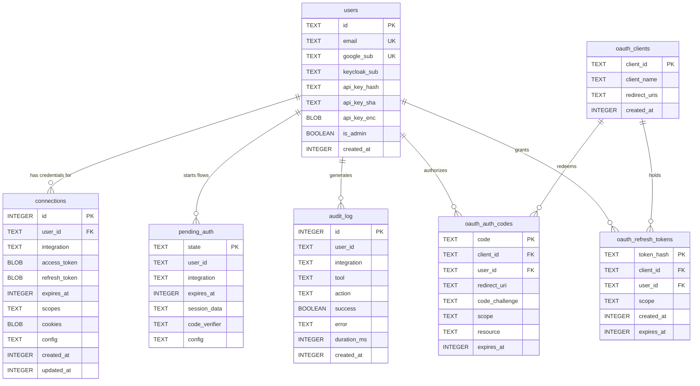

Seven tables. The logical shape is identical on both backends — only the dialect
differs.

The backend is chosen from `DATABASE_URL` alone: a `postgres://` or `postgresql://`
prefix selects PostgreSQL, and **anything else is treated as a SQLite file path**.
There is no separate driver variable.



The relationships are logical. There are **no foreign-key constraints** in the DDL —
`user_id` and `client_id` are plain TEXT columns.

Every timestamp is a Unix time in **seconds**, stored as an INTEGER.

## `users`

Identity. One row per person, created on first SSO login or by the local seed script.

| Column | Type | Stores | Written by |
|---|---|---|---|
| `id` | TEXT PK | A random UUID, or the id passed to the seed script | SSO callbacks, seed script |
| `email` | TEXT UNIQUE | Verified email from the ID token; the join key when linking an existing account to a new provider | SSO callbacks |
| `google_sub` | TEXT UNIQUE | Google subject claim | Google SSO callback |
| `keycloak_sub` | TEXT | Keycloak subject claim. Has a unique partial index rather than a column constraint | Keycloak SSO callback |
| `api_key_hash` | TEXT | bcrypt hash of the API key (cost 10). The legacy path, still checked | API-key mint |
| `api_key_sha` | TEXT | SHA-256 of the API key — the indexed fast lookup. Backfilled on a legacy bcrypt hit | API-key mint and verify |
| `api_key_enc` | BLOB / BYTEA | AES-256-GCM ciphertext of the plaintext key, so the owner can reveal it again | API-key mint |
| `is_admin` | BOOLEAN | Defaults FALSE | — |
| `created_at` | INTEGER | Row creation time | schema default |

## `connections`

The source of truth for "is this user connected to this integration". One row per
user × integration, enforced by `UNIQUE(user_id, integration)`. Writes are upserts on
that pair.

| Column | Type | Stores | Written by |
|---|---|---|---|
| `id` | INTEGER PK | autoincrement / serial | — |
| `user_id` | TEXT NOT NULL | Owner | token store, cookie store |
| `integration` | TEXT NOT NULL | Plugin name | token store, cookie store |
| `access_token` | BLOB / BYTEA | AES-256-GCM ciphertext. For an OAuth connection the provider access token; for an API-key connection the secret field; for a cookie connection the literal sentinel `"cookie-auth"` | OAuth callback, API-key connect, cookie capture |
| `refresh_token` | BLOB / BYTEA | AES-256-GCM ciphertext, when the provider issued one | OAuth callback, lazy refresh |
| `expires_at` | INTEGER | Access-token expiry. Refresh triggers 30 seconds early | OAuth callback, lazy refresh |
| `scopes` | TEXT | Granted scopes, **not encrypted** | OAuth callback |
| `cookies` | BLOB / BYTEA | AES-256-GCM ciphertext of the captured cookie bundle | cookie capture, session import |
| `config` | TEXT | Per-connection JSON settings — the self-hosted `instanceUrl`, or the non-secret API-key fields such as a New Relic region. **Not encrypted** | OAuth connect with an instance, API-key connect |
| `created_at`, `updated_at` | INTEGER | Timestamps | schema defaults |

The upsert uses `COALESCE(excluded.config, connections.config)`, so a token refresh
that re-stores without a config never wipes a stored instance origin.

Disconnecting deletes the whole row. No provider-side revocation is attempted.

## `pending_auth`

In-flight handshake state, minutes-lived. One table serves three unrelated flows,
discriminated by the `integration` column:

| `integration` value | Flow |
|---|---|
| `<plugin name>` | A plugin OAuth handshake — holds the PKCE verifier and the chosen instance origin |
| `google-sso` / `keycloak-sso` | Portal login |
| `__oauth_authorize__` | The MCP OAuth `/authorize` ticket |

| Column | Type | Stores |
|---|---|---|
| `state` | TEXT PK | The random state value, or the authorize ticket |
| `user_id` | TEXT NOT NULL | Owner. Empty string for an authorize ticket, which has no user yet |
| `integration` | TEXT NOT NULL | Flow discriminator, above |
| `expires_at` | INTEGER NOT NULL | 600 seconds out for both plugin OAuth and the authorize ticket |
| `session_data` | TEXT | For an authorize ticket: the validated request as JSON — client, redirect URI, code challenge, scope, state, resource, and the CSRF binding |
| `code_verifier` | TEXT | The PKCE verifier, held server-side |
| `config` | TEXT | Carries `{"instanceUrl": …}` through a self-hosted flow, then copied to `connections.config` |

Rows are single-use: verifying a state deletes it, and redeeming an authorize ticket
deletes it unconditionally whether or not the binding check passes. Expired rows are
swept opportunistically whenever a new one is created.

## `audit_log`

Every tool execution, success or failure.

| Column | Type | Stores |
|---|---|---|
| `id` | INTEGER PK | autoincrement / serial |
| `user_id` | TEXT NOT NULL | Who ran it |
| `integration` | TEXT | Owning plugin |
| `tool` | TEXT | Tool name |
| `action` | TEXT NOT NULL | `EXECUTE` for tool runs |
| `success` | BOOLEAN NOT NULL | Outcome |
| `error` | TEXT | Failure message, when any |
| `duration_ms` | INTEGER | Wall-clock duration |
| `created_at` | INTEGER | Unix seconds |

Indexes: `idx_audit_user(user_id, created_at)` and
`idx_audit_integration(integration, created_at)`.

Rows are written by the audit logger when `AUDIT_LOG_DEST=sqlite` — which, despite the
name, writes to whichever backend is configured. The other destinations write nothing
here.

Nothing prunes this table. Plan retention yourself.

## `oauth_clients`

MCP clients registered through `POST /register`.

| Column | Type | Stores |
|---|---|---|
| `client_id` | TEXT PK | 16 random bytes in hex |
| `client_name` | TEXT | Optional display name from the registration |
| `redirect_uris` | TEXT NOT NULL | JSON array. `/authorize` requires an exact member match |
| `created_at` | INTEGER | Registration time |

No client secret column exists — every registered client is public.

## `oauth_auth_codes`

MCP authorization codes. 32 random bytes, **60-second TTL**.

| Column | Type | Stores |
|---|---|---|
| `code` | TEXT PK | The code |
| `client_id` | TEXT NOT NULL | Checked at redemption |
| `user_id` | TEXT NOT NULL | The authenticated user |
| `redirect_uri` | TEXT NOT NULL | Checked exactly at redemption |
| `code_challenge` | TEXT NOT NULL | S256 challenge, compared in constant time |
| `scope` | TEXT | Defaults to `mcp` |
| `resource` | TEXT | Defaults to `<SERVER_PUBLIC_URL>/mcp` |
| `expires_at` | INTEGER NOT NULL | 60 seconds out |

The row is deleted on any lookup hit, before the checks run — a code cannot be
replayed even by a failed attempt. Revoking an agent also deletes its outstanding
codes.

## `oauth_refresh_tokens`

Rotating refresh tokens, 30-day TTL.

| Column | Type | Stores |
|---|---|---|
| `token_hash` | TEXT PK | SHA-256 hex of the token. The token itself is never stored |
| `client_id` | TEXT NOT NULL | Owning MCP client |
| `user_id` | TEXT NOT NULL | The user who authorized it |
| `scope` | TEXT | Granted scope |
| `created_at` | INTEGER | Carried forward across rotations, so "connected since" survives |
| `expires_at` | INTEGER NOT NULL | 30 days out |

This table is what `GET /api/agents` reads: live rows grouped by `client_id`, joined
to `oauth_clients` for the name, reporting the earliest `created_at` and latest
`expires_at`. The grouping query is dialect-aware — `STRING_AGG` on PostgreSQL,
`GROUP_CONCAT` on SQLite.

Rotation runs SELECT, DELETE, INSERT in one transaction, and single-use is enforced by
the DELETE affecting exactly one row.

## Schema initialisation

There is **no versioned migration table**. Schema setup is one idempotent function
that dispatches on the adapter's dialect, and it is a deliberate explicit call at
startup rather than an import side effect — which is what lets the test suite stand up
a throwaway database of either dialect against the exact production DDL.

- **SQLite** runs the `CREATE TABLE IF NOT EXISTS` block, then eleven bare
  `ALTER TABLE … ADD COLUMN` statements in a try/catch that swallows only
  `duplicate column name` and rethrows anything else.
- **PostgreSQL** runs the same tables, then one `ADD COLUMN IF NOT EXISTS` batch —
  no try/catch needed on 9.6 and later.

The eleven added columns are the ones marked as migrations above: `users.email`,
`users.google_sub`, `users.api_key_enc`, `users.keycloak_sub`, `users.api_key_sha`,
`connections.cookies`, `connections.config`, `pending_auth.session_data`,
`pending_auth.code_verifier`, `pending_auth.config`, and
`oauth_refresh_tokens.created_at`. Two partial indexes follow:
`idx_users_keycloak_sub` (unique, `WHERE keycloak_sub IS NOT NULL`) and
`idx_users_api_key_sha`.

## Where the two backends differ

| Concern | SQLite | PostgreSQL |
|---|---|---|
| Autoincrement PK | `INTEGER PRIMARY KEY AUTOINCREMENT` | `SERIAL` |
| Binary columns | `BLOB` | `BYTEA` |
| Timestamp default | `unixepoch()` | `EXTRACT(EPOCH FROM NOW())::INTEGER` |
| Added columns | Eleven `ADD COLUMN` in try/catch | One `ADD COLUMN IF NOT EXISTS` batch |
| Placeholders | `?` natively | `?` rewritten to `$1, $2, …` before execution |
| BOOLEAN binding | Accepts `1`/`0` | **Rejects `1`/`0`** — must bind a real boolean |
| Transactions | Serialized in-process through a queue | Pinned to one pooled client |

> [!WARNING] Three portability traps
> **BOOLEAN:** PostgreSQL rejects `1`/`0` for a BOOLEAN column. `audit_log.success`
> and `users.is_admin` must be bound as real booleans.
>
> **Placeholders:** `?` is rewritten by a hand-written SQL scanner, not a regex, so it
> correctly skips string literals, quoted identifiers, dollar-quoted strings, comments,
> and the JSONB `?`, `?|`, `?&` operators. A blind global replace would corrupt those
> statements invisibly.
>
> **Transactions:** on PostgreSQL a transaction is pinned to one pooled client. A
> stray call on the shared handle inside a transaction callback silently takes a
> *different* connection and executes outside the transaction. Always use the executor
> the transaction hands you.

`better-sqlite3` is synchronous while the adapter interface is async, so an `await`
inside a SQLite transaction callback yields the loop and a second caller could issue
`BEGIN` mid-transaction. The SQLite adapter chains transactions through a promise
queue that stays alive across rejections. Only transactions are serialized — single
statements are already atomic.

## Migrating SQLite to PostgreSQL

```bash
npm run migrate:sqlite-to-postgres -w @workbench/server   # dry run by default
```

The script applies the production schema to the target first, diffs source and target
columns and reports any source-only columns it will not copy, refuses a non-empty
target unless `--allow-nonempty`, copies everything in one transaction with
`INSERT … ON CONFLICT DO NOTHING`, resyncs every `SERIAL` sequence with `setval`, and
verifies row counts per table. Nothing is written without `--apply`.

`pending_auth` and `oauth_auth_codes` hold short-lived handshake state. `--skip` them
unless the cutover is immediate. The script does not cut over — that is a separate
`DATABASE_URL` change.

> [!DANGER] `ENCRYPTION_KEY` must not change during migration
> Ciphertext is copied verbatim. A different key on the new deployment makes every
> migrated token and cookie bundle undecryptable.
