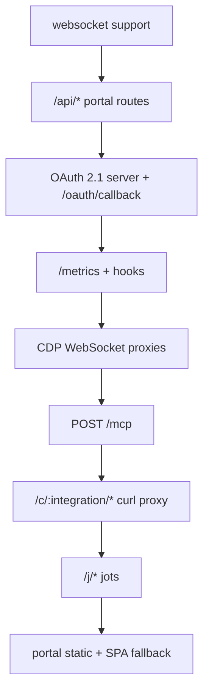

Everything runs on one Fastify instance listening on `0.0.0.0:$PORT`. Registration
order matters, because it decides route precedence and which content-type parser
wins:



The portal is registered last, so API, MCP, and CDP routes always win and the SPA
fallback only catches genuine client-route 404s.

## Auth schemes

Six distinct credentials exist. Confusing them is the main hazard when reading this
page.

| Scheme | Carrier | Used by |
|---|---|---|
| Portal session JWT | `Authorization: Bearer <jwt>` | protected `/api/*` routes |
| Workbench API key | `x-workbench-api-key: <hex>` | protected `/api/*` routes **and** `/mcp` |
| OAuth 2.1 access token | `Authorization: Bearer <jwt>` | `/mcp` only |
| Connect JWT (magic link) | `Authorization: Bearer <jwt>` or `?t=` | `/api/connect/*`, CDP auth frame |
| Curl-session JWT | `Authorization: Bearer <jwt>` | `/c/:integration/*` |
| Jot password cookie | `Cookie` | `/j/:name/*` on password-gated jots |

**The `/api/*` precedence rule:** the shared authenticator checks
`x-workbench-api-key` **first**, then falls back to `Authorization: Bearer` treated
as a *portal session JWT only*.

> [!WARNING] An OAuth access token does not authenticate `/api/*`
> The `/api/*` authenticator never tries the access-token verifier. Only `/mcp`
> accepts an OAuth 2.1 Bearer. Sending one to `/api/integrations` gets a 401.

Protected routes answer 401 `{ "error": "Unauthorized" }`.

## Portal auth and identity

| Method | Path | Auth | Request | Response | Errors |
|---|---|---|---|---|---|
| GET | `/api/auth/providers` | none | — | `{ providers: string[] }` — `"google"` when `GOOGLE_CLIENT_ID` is set, `"keycloak"` when all three Keycloak vars are set | — |
| GET | `/api/auth/google` | none | — | `{ url }` | 503 if `GOOGLE_CLIENT_ID` unset |
| GET | `/api/auth/keycloak` | none | — | `{ url }` | 503 if not configured |
| GET | `/api/auth/google/callback` | provider redirect | query `code`, `state`, `error`; cookie `awb_oauth_binding` | 302 to `PORTAL_URL#token=<sessionJWT>`, or 302 to the MCP client's `redirect_uri` when `state` carries a ticket | 400 on provider `error`, missing `code`, or failure |
| GET | `/api/auth/keycloak/callback` | provider redirect | query `code`, `state`, `error` | 302 to `PORTAL_URL#token=<sessionJWT>` | 400 |
| GET | `/api/auth/me` | session or api-key | — | `{ id, email }` | 401, 404 |
| POST | `/api/auth/logout` | **none** | — | `{ success: true }` | — |

The session JWT arrives in the URL **fragment**, not a query parameter, so it never
reaches the server logs of the portal host.

> [!NOTE] Logout performs no auth check and revokes nothing
> `POST /api/auth/logout` has no authentication and no server-side effect. Sessions
> are stateless JWTs with no revocation list, so logout is a client-side contract:
> the portal drops the token from `localStorage`. A leaked session JWT stays valid
> for its full 24 hours.

The Google callback's ticket branch is the SSO bridge for MCP OAuth — see
[MCP endpoint](mcp-endpoint.md).

## API keys

All four require a session JWT or an existing API key.

| Method | Path | Response | Errors |
|---|---|---|---|
| POST | `/api/keys` | `{ apiKey }` — mints or rotates; the plaintext is returned here and also stored encrypted | 401 |
| GET | `/api/keys` | `{ hasKey: boolean }` | 401 |
| GET | `/api/keys/reveal` | `{ apiKey }`, decrypted | 401; 404 `{ error: "No key set." }` |
| DELETE | `/api/keys` | `{ success: true }` | 401 |

A key is 32 random bytes in hex. It is stored three ways: a bcrypt hash, a SHA-256
hash for the indexed lookup, and an AES-256-GCM ciphertext so the owner can reveal it
again.

## Integrations and connections

| Method | Path | Auth | Response |
|---|---|---|---|
| GET | `/api/integrations` | yes | `{ integrations: [{ name, version, displayName, description, categories, logo, authType, instance?, apikeyFields?, toolCount, configured }] }` |
| GET | `/api/integrations/:integration` | yes | Same fields minus `toolCount`/`configured`, plus `tools: [{ name, description }]`. 404 for an unknown name |
| GET | `/api/integrations/:integration/logo` | **public** | Image bytes, `Cache-Control: public, max-age=86400`. 404 `{ error: "No logo" }` |
| GET | `/api/connections` | yes | `{ connections: [{ name, connected }] }` |
| DELETE | `/api/connections/:integration` | yes | `{ success: true }`. 404 unknown; **400** for `auth.type: "none"` |
| GET | `/api/agents` | yes | `{ agents: [{ client_id, client_name?, scopes, connected_since, expires_at }] }` |
| DELETE | `/api/agents/:clientId` | yes | `{ revoked: <count> }` — idempotent |

`configured` reports whether the *operator* has supplied credentials: always true for
`none`, `cookie`, and `apikey`. It is true for `oauth2` only when the plugin's client-ID
environment variable is set. `connected` reports whether *this user* has a credential.

The logo route is deliberately unauthenticated so a plain `` works. Path
traversal is defused by reducing the parameter to its basename.

`/api/agents` lists OAuth clients that hold live refresh tokens on this account —
which AI clients can reach your workbench — grouped by `client_id`. Revocation
deletes refresh tokens and outstanding authorization codes. Live access tokens
survive until their TTL.

## Connecting an integration

**`GET /api/auth/:integration`** is the connect entry point. It is authenticated, and
the response is a union keyed on the integration's auth type:

| Auth type | Response | Notes |
|---|---|---|
| `none` | `{ type: "none", connected: true }` | |
| `cookie` | `{ type: "cookie", status: "login_required", cdpToken, cdpProxyUrl, loginUrl }` | Side effect: ensures the warm per-user Chromium and navigates it to `loginUrl` |
| `oauth2` | `{ type: "oauth2", url }` | Optional `?instanceUrl=` for self-hosted. **503** with the thrown message when credentials are missing |
| `apikey` | `{ type: "apikey", fields }` | The portal renders the fields |
| anything else | `{ state }` | Fallthrough: mints an auth state row and returns it. Unreachable with the shipped manifests, which declare only the four types above |

| Method | Path | Auth | Request | Response and errors |
|---|---|---|---|---|
| POST | `/api/auth/apikey/:integration` | yes | `{ values: Record<string,string> }` | `{ success: true }`. 404 if not apikey; 400 `Missing required field: <label>`; 400 `<label> must be one of: …`; 500 if the manifest declares no `secret` field |
| GET | `/api/auth/plugin/:integration/callback` | provider redirect | query `code`, `state`, `error` | 302 to `PORTAL_URL#connected=<integration>`. 400 on provider error, missing code or state, or exchange failure |
| POST | `/api/auth/cookie/:integration/capture` | yes | no body | `{ success: true, cookieCount }`. **400 when zero cookies were captured**; 404 if not cookie-auth |
| POST | `/api/auth/cookie/:integration/cancel` | yes | no body | `{ success: true }` — a deliberate no-op; the idle reaper closes the shared session |
| GET | `/api/integrations/:integration/session/export` | yes | — | `{ integration, session }`. 404 if not cookie-auth or nothing stored |
| POST | `/api/integrations/:integration/session/import` | yes | `{ session }` or a bare cookie array | `{ success: true, cookieCount }`. 400 on an empty or invalid bundle; 404 if not cookie-auth |
| POST | `/api/browser-session/reset` | yes | — | `{ success: true }`. **409** while a session is active; else 400 |
| POST | `/api/browser-session/live-url` | yes | `{ url?: string }` | `{ url }` — a portal browser page carrying a connect JWT. 400 for a non-string or non-http(s) `url`; **409** while a session is active |

The plugin OAuth callback is a single generic route. The `/plugin/` segment exists so
it cannot collide with `/api/auth/google/callback`.

> [!WARNING] The callback URL you register with a provider is `/api/auth/plugin/<integration>/callback`
> Not `/api/auth/<integration>/callback`. Registering the shorter form produces a
> `redirect_uri` mismatch at consent time.

`POST /api/browser-session/reset` wipes the whole per-user browser profile, logging
that user out of every cookie integration at once.

## Connect-JWT (magic-link) endpoints

These serve the account-less `/connect/:integration` and `/browser` portal pages. They
take a connect JWT, not a portal session.

| Method | Path | Carrier | Response |
|---|---|---|---|
| GET | `/api/connect/session` | `Authorization: Bearer <connectJWT>` | `{ integration, loginUrl, cdpProxyUrl, sessionId, cdpToken }`. 401 missing/invalid/expired; 404 if not cookie-auth |
| POST | `/api/connect/capture` | `Authorization: Bearer <connectJWT>` | `{ success: true, cookieCount }`. 401; 404; **400 on zero cookies** |
| GET | `/api/connect/browser-session` | query `?t=<connectJWT>` | `{ cdpProxyUrl, sessionId, cdpToken }`. 400 missing token; 401 invalid/expired; **400 unless the token's integration is `__browser__`** |

## CDP WebSocket proxies

`GET /api/auth/cookie/:integration/cdp` and `GET /api/browser-session/cdp`, both
WebSocket upgrades. Identical mechanism.

- **Origin is checked twice.** A `preValidation` hook 403s the upgrade for a
  non-allowlisted `Origin`, and the handler re-checks and closes with **4403**. The
  allowlist is exactly `PORTAL_URL` and `SERVER_PUBLIC_URL`, normalised to
  `protocol//host`.
- **Auth is in-band, not in the URL.** The first client frame must be JSON
  `{ type: "auth", sessionId, cdpToken, bearer }`, where `bearer` is a session JWT or
  a connect JWT. The integration is pinned to the route's `:integration` on the
  cookie proxy and to the literal `__browser__` on the browser proxy, so a token
  minted for one cannot be replayed on the other.
- On success the server sends `{"type":"ready"}` and proxies. Frames are normalised
  to text in both directions, because Chromium closes on binary opcodes.

| Close code | Meaning |
|---|---|
| 4400 | Malformed auth frame |
| 4401 | Unauthorized |
| 4403 | Disallowed `Origin` |
| 4408 | No auth frame within 5 seconds |

> [!WARNING] A wrong `PORTAL_URL` or `SERVER_PUBLIC_URL` breaks cookie capture
> Both variables form the WebSocket origin allowlist. If either does not match the
> browser's actual origin, the upgrade 403s and live login capture silently fails.

## OAuth 2.1 authorization server

All unauthenticated. Full behaviour is on the [MCP endpoint](mcp-endpoint.md) page.

| Method | Path | Request | Response |
|---|---|---|---|
| GET | `/.well-known/oauth-protected-resource` | — | Resource metadata |
| GET | `/.well-known/oauth-authorization-server` | — | Authorization-server metadata |
| POST | `/register` | `{ client_name?, redirect_uris: [] }` | **201** with `client_id`. 400 `invalid_client_metadata` |
| GET | `/authorize` | query `client_id`, `response_type`, `redirect_uri`, `code_challenge`, `code_challenge_method`, `scope?`, `state?`, `resource?` | 302 to Google SSO, setting `awb_oauth_binding`. 400 `invalid_request`; 400 `unsupported_response_type` |
| POST | `/token` | form `grant_type=authorization_code` + `code`, `client_id`, `redirect_uri`, `code_verifier`; or `grant_type=refresh_token` + `refresh_token`, `client_id` | `{ access_token, token_type, expires_in, refresh_token, scope }`. 400 `invalid_grant`; 400 `unsupported_grant_type` |
| GET | `/oauth/callback` | — | Static HTML landing page |

`/oauth/callback` is the out-of-band landing page for CLI agents. It does **zero**
server-side work — no code exchange, no token storage. It renders the current URL
into an input field for a human to copy back to their agent, and ships with a strict
CSP, `X-Frame-Options: DENY`, and `Referrer-Policy: no-referrer`.

## The curl proxy

**`/c/:integration/*`** accepts `GET`, `POST`, `PUT`, `PATCH`, `DELETE`, `HEAD`, and
`OPTIONS`. It runs in its own scope with a catch-all raw-buffer body parser, so
request bytes are forwarded exactly as sent.

Auth is a curl-session token only, from [`curl_session`](meta-tools.md):

```
Authorization: Bearer <curl-session-token>
```

Failure modes, in the order they are checked:

| Status | Message |
|---|---|
| 401 | `Authorization: Bearer <curl-session-token> required` |
| 401 | `Invalid or expired curl session token` |
| 403 | `Integration "<x>" is not in this curl session` |
| 400 | `Integration "<x>" does not support curl proxy` |
| 502 | `Cannot resolve proxy base URL: <msg>` |
| 502 | `Upstream request failed: <msg>` |

The upstream base URL comes from the manifest's `proxy` block: a static `baseUrl`, or
`resolver: "instance-url"` (the connection's own instance origin plus
`proxy.pathPrefix`), or `resolver: "newrelic-region"`. The target is
`<base>/<tail>` plus the original query string.

Hop-by-hop headers **and `authorization`** are stripped from the request — the proxy
injects the real credential itself — and hop-by-hop headers are stripped from the
response. On success the upstream status and headers are returned and the body is
streamed, not buffered.

## Jots

Static artifact hosting. Full guide: [Jots](../guides/jots.md).

| Method | Path | Auth | Behaviour |
|---|---|---|---|
| GET | `/j/:name` | none | 301 to `/j/:name/`. 404 on an invalid name |
| GET | `/j/:name/*` | jot cookie when `access` is `password` | Serves files; a directory falls back to `index.html`. 404 for an invalid name, a missing manifest, a missing file, or **any request for the manifest file itself**; **403** on traversal; on a locked jot, 200 plus the unlock page for browser navigations and **401** otherwise |
| POST | `/j/:name/__auth` | password form | Sets the jot cookie (httpOnly, `SameSite=Lax`, `Max-Age=2592000`, `Secure` in production) and 302s to `/j/:name/`. **401** plus the unlock page on a wrong password; 404 invalid name or no manifest; 302 if the jot is not password-gated |
| OPTIONS | `/j/:name/*` | none | Preflight. **204** plus `Access-Control-Allow-Origin: *`, `Access-Control-Allow-Methods`, and `Access-Control-Max-Age` for a public jot with `cors` enabled; **404** for every other jot, so CORS posture is not discoverable |
| POST | `/j/upload/:token` | single-use mint token in the path | Body is a gzip tarball, streamed. 200 with the commit result. **404** unknown or consumed token, or a patch whose jot no longer exists; **403** a patch whose jot changed owner; **413** `TOO_LARGE` / `TOO_MANY_FILES`, from the archive and again from the merged tree on a patch; **400** `BAD_ARCHIVE`, `NO_INDEX`, `INVALID_PATH`, or another extract error; **409** `JOT_NAME_TAKEN`; **500** `DEPLOY_FAILED` |

A token minted by `update_jot` puts the upload in **patch** mode: the live tree is staged,
the token's delete list applied, and the archive overlaid on top, so an uploaded path wins
over a delete of itself. `NO_INDEX` is still checked, but a patch normally inherits the
live `index.html`. `access` and the password hash come from the live manifest, never the
token, so a patch cannot change a jot's gating.

Jot **content** responses carry `Content-Security-Policy: sandbox allow-scripts
allow-forms`, `nosniff`, `X-Frame-Options: SAMEORIGIN`, and
`Cross-Origin-Resource-Policy: same-origin` — that is, every served file plus the
two unlock-page responses. The bare status replies do not: the 404s, the 403 on
traversal, and the plain `401 Unauthorized` for a non-browser request to a locked
jot are sent without any of those headers. The sandbox puts a served page on an
opaque origin, so jot JavaScript cannot read app cookies or make credentialed
same-origin calls to `/api` or `/mcp`.

> [!WARNING] By default, a jot cannot fetch its own data files
> The opaque origin blocks same-origin `fetch` from the page. Inline everything a jot
> needs — it has to be self-contained, unless it opts into `cors`.

A **public** jot deployed or updated with `cors: true` instead carries
`Access-Control-Allow-Origin: *` and `Cross-Origin-Resource-Policy: cross-origin` on its
content responses, which is what lets the page fetch its own files. The `sandbox`,
`nosniff`, and `X-Frame-Options` headers are unchanged. The flag is ignored on password
jots: an opaque-origin fetch sends no cookie, so the request would 401 regardless.

The manifest file is answered with 404 rather than 403, so a probe cannot confirm it
exists.

## MCP

| Method | Path | Auth | Notes |
|---|---|---|---|
| POST | `/mcp` | api key, OAuth access token, or session JWT | See [MCP endpoint](mcp-endpoint.md) |

## Health, metrics, and the portal

**`GET /metrics`** returns Prometheus text format and is **unauthenticated**.
`onRequest`/`onResponse` hooks record `workbench_http_requests_total` and
`workbench_http_request_duration_seconds`, labelled `{method, route, status}`, for
every request except `/metrics` itself.

> [!WARNING] There is no health endpoint
> No `/health`, `/healthz`, or `/readyz` route exists, and the Docker image declares
> no `HEALTHCHECK`. An orchestrator probe has to use `/metrics` or a plain TCP check.

The built portal is served statically at `/`, with a not-found handler that returns
`index.html` for any GET **not** starting with `/api`, `/mcp`, or `/.well-known` —
those keep JSON 404s. If no portal build directory is found the static plugin returns
early, and then there is no 404 handler at all.
