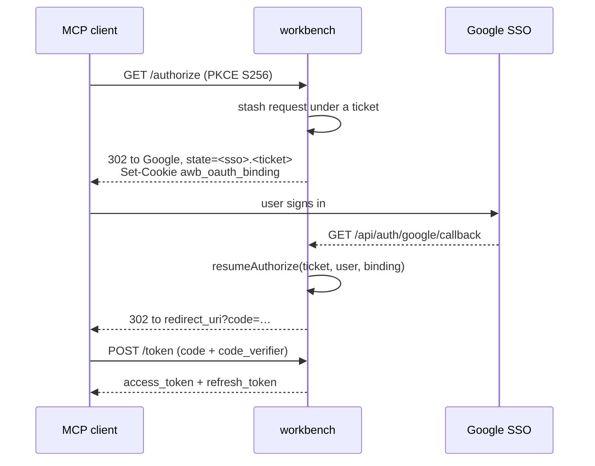

`POST /mcp` is the entire MCP surface. There is no `GET /mcp`, no SSE stream, and no
`DELETE /mcp`.

## Transport

Plain JSON-RPC 2.0 over HTTP POST. One request, one response.

There is **no session handling**. `Mcp-Session-Id` is never read and never emitted.
Every request is independently authenticated and carries no server-side state from
the request before it, which is why the server can run in cluster mode behind a
plain round-robin load balancer.

When a handler returns nothing — the `notifications/initialized` notification is the
only case — the server replies **202 Accepted with an empty body**.

## Authenticating

Three credentials reach `/mcp`, resolved strictly in this order:

| Order | Header | Credential | Verifier |
|---|---|---|---|
| 1 | `x-workbench-api-key: <hex>` | Workbench API key | API-key verifier (SHA-256 indexed lookup, bcrypt fallback) |
| 2 | `Authorization: Bearer <jwt>` | OAuth 2.1 access token | Access-token verifier |
| 3 | `Authorization: Bearer <jwt>` | Portal session JWT | Session verifier — tried only if the access-token verify throws |

The API key goes in its own header. Do not send it as `Bearer`.

The two `Bearer` tokens are different tokens with different verifiers, even though
both are HS256 signed with the same `SESSION_SECRET`. They are separated by audience
and by a `token_type` claim:

| Token | `aud` | `iss` | Distinguishing claim | TTL |
|---|---|---|---|---|
| Portal session JWT | `workbench` | `workbench` | `email` | 24 hours |
| OAuth 2.1 access token | `<SERVER_PUBLIC_URL>/mcp` | `SERVER_PUBLIC_URL` | `token_type: "oauth"`, plus `scope` and `client_id` | `OAUTH_ACCESS_TOKEN_TTL_SECONDS`, default 3600 |

The access-token verifier rejects anything without `token_type === "oauth"` and
string `sub`, `scope`, and `client_id` claims.

> [!WARNING] An OAuth access token does not work on `/api/*`
> The portal API authenticator accepts the API key or a portal session JWT only. An
> OAuth 2.1 access token authenticates `/mcp` and nothing else.

### The 401 challenge

An unauthenticated request gets HTTP 401 with a challenge header pointing at the
protected-resource metadata, and a JSON-RPC error body echoing the request `id`
(or `null`):

```
WWW-Authenticate: Bearer realm="workbench", resource_metadata="<SERVER_PUBLIC_URL>/.well-known/oauth-protected-resource"
```

```json
{
  "jsonrpc": "2.0",
  "id": 1,
  "error": {
    "code": -32001,
    "message": "Unauthorized",
    "data": { "resource_metadata": "<SERVER_PUBLIC_URL>/.well-known/oauth-protected-resource" }
  }
}
```

An MCP client that implements OAuth 2.1 discovery follows that header into the flow
below without any manual configuration.

## JSON-RPC methods

| Method | Behaviour |
|---|---|
| `initialize` | Echoes the client's `params.protocolVersion`, defaulting to `2025-06-18`. Returns `capabilities: { tools: {} }` and `serverInfo: { name: "workbench", version: "0.1.0" }` |
| `notifications/initialized` / `initialized` | No result — HTTP 202, empty body |
| `tools/list` | The nine meta-tools, each `{ name, description, inputSchema }`. Plugin tools are never listed |
| `tools/call` | Runs one meta-tool. See below |
| `resources/list` | `{ resources: [] }` |
| `prompts/list` | `{ prompts: [] }` |
| anything else | `{ error: { code: -32601, message: "Method not found: <m>" } }` |

> [!NOTE] `serverInfo.version` is hardcoded
> The handshake reports `0.1.0` regardless of the released version. Do not use it to
> detect server capabilities.

`tools/call` returns two protocol-level errors, both `-32602`:

- `Tool not found: <name>` for a name that is not one of the nine meta-tools.
- `Invalid arguments: <message>` when the meta-tool's Zod schema rejects the
  arguments.

Everything else — including plugin tools that fail — comes back as a successful
result. See [`execute_tools`](meta-tools.md).

## Result rendering and the 60,000-character cap

A meta-tool's return value is JSON-stringified into a single `{ type: "text" }`
content block, capped at **60,000 characters**. Past the cap the text is truncated
and this notice is appended:

```
…[result truncated: N chars total, showing first 60000. Narrow the request (limit/fields/pagination) to get complete data.]
```

Truncated output is deliberately no longer valid JSON — a client cannot silently
parse a half-result as if it were complete. Narrow the request instead: most plugin
tools take a `limit`, a page cursor, or a field selector.

One exception bypasses the text block entirely. If the result carries an
`_mcpImage: { data, mimeType }` sentinel — directly, under a `{ result }` wrapper, or
anywhere inside an `execute_tools` `{ results: [{ result }] }` batch — the content
becomes image blocks instead, and the text block is dropped. This is how
`browser_screenshot` returns a picture.

## OAuth 2.1 discovery surface

workbench is both the protected resource and its own authorization server. All of
the following are unauthenticated.

### Metadata

`GET /.well-known/oauth-protected-resource`

```json
{
  "resource": "<BASE>/mcp",
  "authorization_servers": ["<BASE>"],
  "bearer_methods_supported": ["header"],
  "scopes_supported": ["mcp"]
}
```

`GET /.well-known/oauth-authorization-server`

```json
{
  "issuer": "<BASE>",
  "authorization_endpoint": "<BASE>/authorize",
  "token_endpoint": "<BASE>/token",
  "registration_endpoint": "<BASE>/register",
  "response_types_supported": ["code"],
  "grant_types_supported": ["authorization_code", "refresh_token"],
  "code_challenge_methods_supported": ["S256"],
  "token_endpoint_auth_methods_supported": ["none"],
  "scopes_supported": ["mcp"]
}
```

`<BASE>` is `SERVER_PUBLIC_URL`, captured at module load.

### Dynamic client registration

`POST /register` implements RFC 7591 for **public clients only**. No initial access
token is required and no client secret is ever issued. It takes
`{ client_name?, redirect_uris: [] }` and answers 201 with the `client_id`,
`token_endpoint_auth_method: "none"`, `grant_types: ["authorization_code",
"refresh_token"]`, and `response_types: ["code"]`. A missing or empty
`redirect_uris` is 400 `invalid_client_metadata`.

> [!WARNING] Registration is open and unrate-limited
> Anyone who can reach the server can register a client. Registration alone grants
> nothing — a client still needs a user to complete SSO — but put the server behind a
> network boundary you trust.

### PKCE and the state-ticket SSO resumption

`GET /authorize` validates four things, in order. The `client_id` resolves to a
registered client. `response_type` is `code`. The `redirect_uri` is an exact member
of that client's registered list, with no prefix matching. `code_challenge` is
present with `code_challenge_method=S256`. PKCE is mandatory and `plain` is rejected.

The problem it then solves: the user is not logged in yet, and the authorization
request has to survive a round trip through Google SSO. It does that with a ticket.



The validated authorization request is stored as a pending row keyed by a random
ticket with a 600-second TTL. `scope` defaults to `mcp`, and `resource` to
`<SERVER_PUBLIC_URL>/mcp`. The server also sets an `awb_oauth_binding` cookie —
httpOnly, `SameSite=Lax`, `Max-Age=600`, and `Secure` when `SERVER_PUBLIC_URL` is
https — and appends the ticket to the SSO state as `<ssoState>.<ticket>`.

On the Google callback the ticket row is looked up and **deleted unconditionally**,
so it is single-use whatever the outcome. The server compares the binding cookie to the
stored value with a constant-time comparison. A missing or mismatched binding is
the login-CSRF guard, and aborts the resumption. If resumption fails the callback
falls through to a normal portal login rather than erroring, and the cookie is
cleared either way.

Authorization codes are 32 random bytes with a **60-second TTL**. Redeeming one
deletes the row on any lookup hit, then checks `client_id`, exact `redirect_uri`,
and the S256 challenge in constant time.

> [!NOTE] Only Google can complete this flow
> `/authorize` builds a Google SSO URL. Keycloak works for portal login but cannot
> complete an MCP authorization.

### Token, refresh, and rotation

`POST /token` takes `application/x-www-form-urlencoded`. There is no client
authentication — these are public clients — so `client_id` comes from the body.

| `grant_type` | Body fields | Result |
|---|---|---|
| `authorization_code` | `code`, `client_id`, `redirect_uri`, `code_verifier` | `{ access_token, token_type: "Bearer", expires_in, refresh_token, scope }` |
| `refresh_token` | `refresh_token`, `client_id` | A new access token **and a new refresh token** |
| anything else | — | 400 `unsupported_grant_type` |

Refresh tokens are 32 random bytes, stored only as a SHA-256 hash, with a **30-day**
TTL. Every redemption rotates them: the rotation runs SELECT, DELETE, INSERT in one
transaction, and single-use is enforced by the DELETE affecting exactly one row, so
two concurrent presentations cannot both mint a replacement. The original
`created_at` is carried forward across rotations, which is what makes "connected
since" meaningful in the agents list.

Presenting another client's refresh token still burns it — the client-id check runs
after the committed delete, deliberately.

### Revoking a client

A user can see every OAuth client holding live refresh tokens on their account, and
revoke one, through `GET /api/agents` and `DELETE /api/agents/:clientId`.

> [!WARNING] Revocation is soft
> Deleting the refresh tokens stops the client renewing, but access tokens are
> self-contained JWTs and stay valid until they expire — up to
> `OAUTH_ACCESS_TOKEN_TTL_SECONDS`, one hour by default. Lower that value if you need
> a tighter revocation window.
