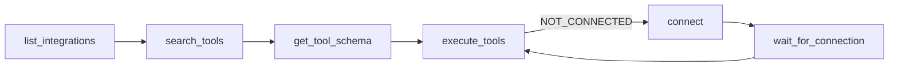

`tools/list` on `/mcp` returns exactly nine tools, no matter how many plugin tools
are loaded. Everything else — all 178 plugin tools and the 12 built-in tools — is
reached through these nine. That is the whole point of the design: your agent's
context holds nine schemas instead of 190.

There is no `execute_tool` (singular). Single execution is `execute_tools` with a
one-element `executions` array.

The normal sequence is discover, then inspect, then run:



## search_tools

Search every registered plugin tool by name or description. This is the entry
point — plugin tools never appear in `tools/list`, so this is how an agent learns
that `jira_create_issue` exists.

**Description as the client sees it:** *Search available tools by name or description*

| Parameter | Type | Required | Default | Description |
|---|---|---|---|---|
| `query` | string | yes | — | Search keyword |

Returns `{ tools: [{ name, description, integration }] }`. Matching is over both
name and description. The entry's `integration` is the owning plugin. Pass it to
`connect` if execution later reports `NOT_CONNECTED`.

```json
{ "name": "search_tools", "arguments": { "query": "pull request" } }
```

## get_tool_schema

Fetch one tool's input schema, converted from the plugin's Zod schema to portable
JSON Schema so any MCP client can read it without Zod. A non-Zod schema passes
through unchanged.

**Description as the client sees it:** *Get input schema for a specific tool*

| Parameter | Type | Required | Default | Description |
|---|---|---|---|---|
| `tool` | string | yes | — | Tool name |

Returns `{ schema: <JSON Schema> }`, or `{ error: "Tool not found" }` for an
unknown name.

```json
{ "name": "get_tool_schema", "arguments": { "tool": "github_create_pr" } }
```

## execute_tools

Run one or more plugin tools. This is the only execution path.

**Description as the client sees it:** *Execute one or more tools in a single call.
Runs them concurrently (bounded) and returns a `results` array in the same order as
`executions`. A single tool failing does not abort the others — its entry carries an
`error` instead of a `result`. For a single tool, pass a one-element `executions`
array.*

| Parameter | Type | Required | Default | Description |
|---|---|---|---|---|
| `executions` | array of objects, min 1 | yes | — | Tools to run; results are returned in this same order |
| `executions[].tool` | string | yes | — | Tool name returned by `search_tools` |
| `executions[].args` | object | no | `{}` | Arguments for the tool |

Returns `{ results: [...] }`, index-aligned with `executions`. Each entry is either
`{ result }` on success or an error object. A batch runs through a bounded worker
pool with a concurrency of 8. The server preserves ordering regardless of completion order.

Three error shapes can appear inside `results`:

| Shape | Cause |
|---|---|
| `{ error: "Tool not found" }` | No tool registered under that name |
| `{ error: "NOT_CONNECTED", integration, message }` | The owning integration has no stored credential — call `connect(integration)` |
| `{ error: "<message>" }` | Argument validation failed, or the plugin handler threw |

Arguments are validated against the plugin tool's own Zod schema before the handler
runs, which is what applies the schema's `.default()` values.

```json
{
  "name": "execute_tools",
  "arguments": {
    "executions": [
      { "tool": "github_list_prs", "args": { "owner": "acme", "repo": "demo-repo" } },
      { "tool": "slack_send_message", "args": { "channel": "C123", "text": "PRs listed" } }
    ]
  }
}
```

> [!WARNING] A failing tool still returns JSON-RPC success
> Only protocol errors (unknown meta-tool, bad meta-tool arguments) come back in the
> JSON-RPC `error` field. A plugin tool that doesn't exist, isn't connected, or
> throws arrives as a successful result whose text content contains
> `{"results":[{"error": ...}]}`. A client that inspects only the JSON-RPC `error`
> field will read every tool failure as a success.

## whoami

Return the authenticated workbench user behind the current request. Identity only —
it says nothing about which integrations are connected.

**Description as the client sees it:** *Return the current authenticated workbench
user (id + email). Like /me — identity only, not connected integrations.*

No parameters.

Returns `{ id, email }`, or `{ error: "User not found" }`.

```json
{ "name": "whoami", "arguments": {} }
```

## list_integrations

List every registered integration and whether this user is connected to it.

**Description as the client sees it:** *List all available integrations and
connection status*

No parameters.

Returns `{ integrations: [{ name, version, connected }] }`. `connected` is `true`
for `auth.type: "none"` integrations, a live-cookie check for cookie integrations,
and "a stored token exists" for everything else.

This is deliberately leaner than the portal's `/api/integrations` — it carries no
`displayName`, `logo`, `authType`, or `toolCount`.

```json
{ "name": "list_integrations", "arguments": {} }
```

## connect

Begin connecting an integration and get back a URL for the user to open.

**Description as the client sees it:** *Begin connecting an integration. For oauth2,
returns a URL (OAuth consent page) and a connectionId; call wait_for_connection
afterward. For cookie integrations, always returns a portal login URL and a
connectionId — the user opens it to log in live and click Capture; call
wait_for_connection afterward.*

| Parameter | Type | Required | Default | Description |
|---|---|---|---|---|
| `integration` | string | yes | — | Integration name |

Response depends on the integration's declared auth type:

| Auth type | Response |
|---|---|
| `oauth2` | `{ connectionId, type: "oauth2", url }` — `url` is the provider consent page |
| `cookie` | `{ connectionId, type: "cookie", url }` — `url` is a portal login page carrying a short-lived connect token; it also warms the user's browser session and navigates it to the login page |
| `none` | `{ error: "<name> is built-in and always connected — no connect needed." }` |
| unknown | `{ error: "Integration not found" }` |

The pending record lives for `CONNECT_TTL_SECONDS` (default 600).

> [!NOTE] API-key integrations do not connect from the agent
> `connect` has no `apikey` branch. An API-key integration falls into the OAuth path
> and errors. Connect those from the portal instead — see
> [API-key connections](../guides/api-key-connections.md).

```json
{ "name": "connect", "arguments": { "integration": "github" } }
```

## wait_for_connection

Block until a connection started by `connect` finishes, so the agent can resume
without polling logic of its own.

**Description as the client sees it:** *Block until a connection started by connect()
completes. Returns status CONNECTED, TIMEOUT, or EXPIRED.*

| Parameter | Type | Required | Default | Description |
|---|---|---|---|---|
| `connectionId` | string | yes | — | ID returned by `connect()` |
| `timeoutSec` | number (positive integer, max 900) | no | `300` | Max seconds to wait |

Returns `{ status: "CONNECTED" }`, `{ status: "EXPIRED" }`, `{ status: "TIMEOUT" }`,
or `{ error: "Unknown connectionId" }`. It polls once per second. On timeout it reaps
the pending record before returning.

A `connectionId` belonging to a different user returns the same
`Unknown connectionId` shape as one that never existed — there is no existence
oracle.

```json
{ "name": "wait_for_connection", "arguments": { "connectionId": "…", "timeoutSec": 600 } }
```

## get_auth_url

Deprecated alias of `connect`, kept for older clients. Same parameters, same handler,
same responses.

**Description as the client sees it:** *Deprecated alias of connect(). Get a URL to
connect an integration.*

| Parameter | Type | Required | Default | Description |
|---|---|---|---|---|
| `integration` | string | yes | — | Integration name |

Prefer `connect` in new code.

## curl_session

Mint a short-lived proxy token that lets the agent make arbitrary HTTP calls against
the named integrations through [the curl proxy](http-api.md), which injects the
user's real credential.

**Description as the client sees it** (verbatim — the risk language is part of the
schema an agent reads): *HIGH RISK — do not call without explicit user approval.
Mints a short-lived (15 min) proxy token granting ARBITRARY API calls
(GET/POST/PUT/PATCH/DELETE), including destructive writes, against the listed
integration(s) — the proxy injects the user's real credential transparently at
/c/&lt;integration&gt;/&lt;path&gt;, so anything reachable via that credential is
reachable through this token. Before invoking, tell the user exactly which
integration(s) and what action you intend to perform, and wait for their explicit
go-ahead; do not mint speculatively or as a default first step. Only integrations
that have curl proxy enabled are accepted.*

| Parameter | Type | Required | Default | Description |
|---|---|---|---|---|
| `integrations` | array of strings, min 1 | yes | — | Integration names to include in the session |

On success:

```json
{
  "token": "<jwt>",
  "expiresIn": 900,
  "proxyBaseUrl": "https://workbench.example.com/c",
  "usage": "Send requests to https://workbench.example.com/c/<integration>/<path> with Authorization: Bearer <token>"
}
```

`expiresIn` is a fixed 900 seconds — it is not configurable.

Validation is all-or-nothing. Every name is checked, and if any fail the whole call
returns `{ error }` with the failures joined by `; `:

| Error fragment | Cause |
|---|---|
| `<name>: integration not found` | No such integration |
| `<name>: curl proxy not enabled` | The manifest has no `proxy` block |
| `<name>: not connected` | No stored credential for this user |

> [!DANGER] This token can do anything the user's credential can do
> Anything the stored credential can reach — including destructive writes — is
> reachable with this token for 15 minutes. Ask the user before minting one, name the
> integrations and the intended action, and do not mint speculatively.

```json
{ "name": "curl_session", "arguments": { "integrations": ["github"] } }
```
