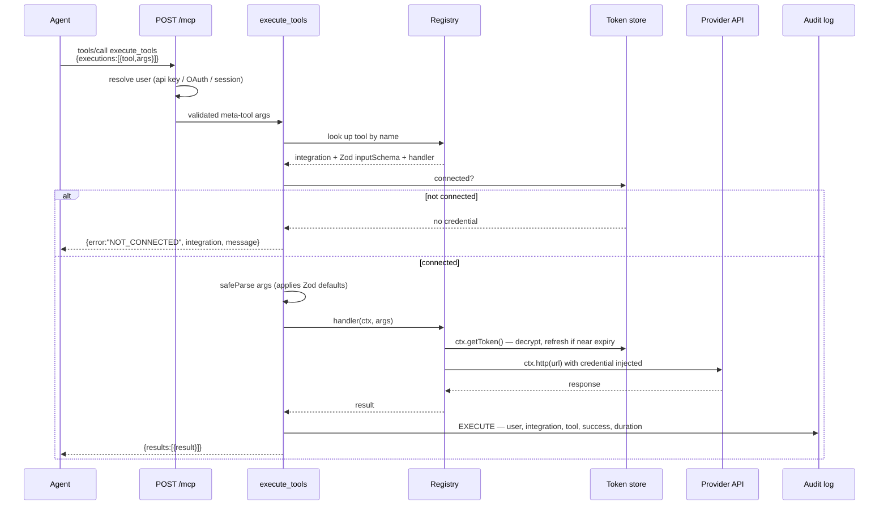
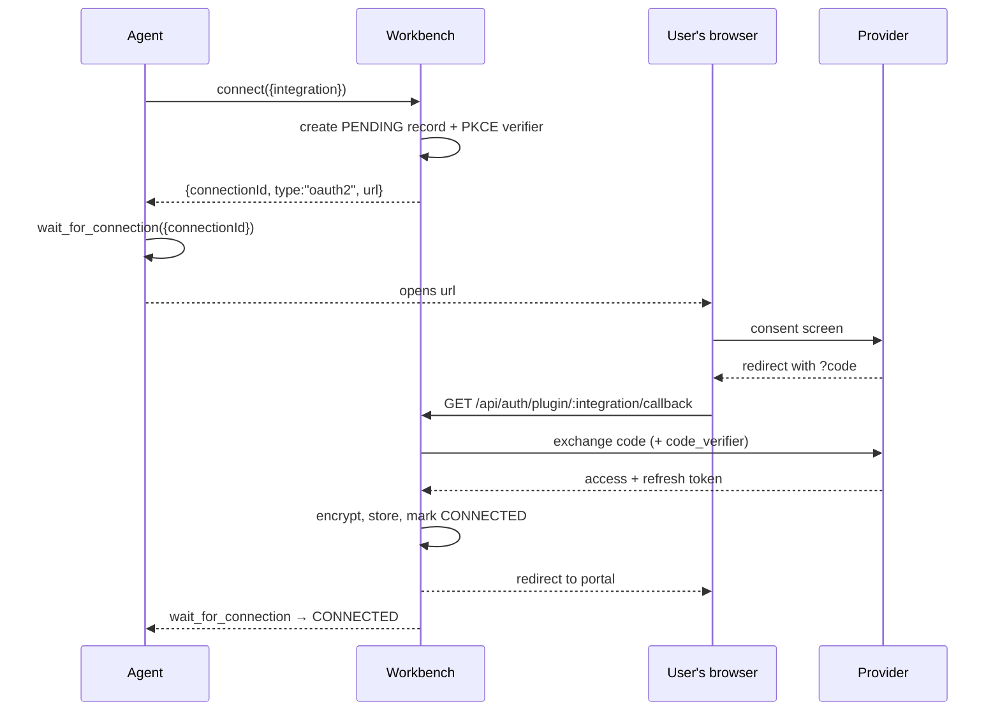

a-workbench is one Fastify process. It serves the MCP endpoint, the portal API, the
portal's static build, the OAuth 2.1 authorization server, the curl proxy, and the
jots host — all on the same port, registered in a fixed order so API routes win and
the single-page app only catches genuine client-route 404s.

## The packages

| Package | What it is |
|---|---|
| `packages/shared` | Types and Zod schemas shared by server and portal — `Integration`, the four auth configs, `ToolDefinition`. |
| `packages/server` | Fastify app: MCP endpoint, meta-tools, plugin loader and registry, auth (portal SSO, API keys, OAuth 2.1 AS, plugin OAuth), the browser-session machinery, audit log, metrics. |
| `packages/portal` | Vite + React + TanStack Query SPA. Built to static files and served by the server in production. |
| `packages/plugins` | The 16 shipped integrations, one directory each: `manifest.ts` plus `tools/index.ts`. |

Two more integrations — `browser` and `jots` — live inside the server source rather
than under `packages/plugins`. Their handlers reach directly into the browser
session and the jot store, and keeping them out of the plugin directory keeps those
capabilities out of the plugin context, so a third-party plugin can never drive a
user's logged-in capture browser. Their names are reserved: a plugin directory
called `browser` or `jots` is refused at load.

## What a tool call does

`tools/list` returns only the meta-tools. A plugin tool is reached through
`execute_tools`, which resolves the name against the registry and runs it.

Four things about that path are worth knowing before you write a client.

**Failures come back as successes.** Inside `tools/call`, only two things produce a
JSON-RPC `error`: an unknown meta-tool name, and meta-tool arguments that fail their
schema — both code `-32602`. (The endpoint also emits `-32601 Method not found` for an
unrecognised method and `-32001 Unauthorized` for a missing or bad credential.) A plugin tool that doesn't exist, isn't connected, or throws arrives
as a *successful* result whose text content contains `{"results":[{"error": …}]}`.
A client that only inspects the JSON-RPC `error` field will read tool failures as
successes.

**`NOT_CONNECTED` is the cue to connect.** It is the only error shape carrying
extra fields — `integration` and a `message` naming the `connect()` call to make.

**Arguments are validated against the plugin's own Zod schema** before the handler
runs, so `.default()` values are filled in. A validation failure returns
`Invalid arguments for <tool>: …` rather than reaching the handler.

**Batches are concurrent and independent.** `execute_tools` runs up to 8 at a time
through a bounded pool and returns `results` index-aligned with `executions`. One
failure does not abort the others.

## Where credentials live

Everything persistent is one row per user per integration in a `connections` table,
in SQLite or PostgreSQL — the backend is chosen by whether `DATABASE_URL` starts
with `postgres://` or `postgresql://`. Anything else is treated as a SQLite file path.

| Column | Contents |
|---|---|
| `access_token` | AES-256-GCM ciphertext. For cookie integrations this holds a sentinel; the bundle is in `cookies`. |
| `refresh_token` | AES-256-GCM ciphertext. |
| `cookies` | AES-256-GCM ciphertext of the captured cookie bundle. |
| `expires_at`, `scopes` | Plaintext. |
| `config` | Plaintext JSON — per-connection settings such as a self-hosted instance origin or a New Relic region. |

The key is `ENCRYPTION_KEY`, read once at module load. The stored layout is a
16-byte IV, a 16-byte auth tag, then ciphertext.

Third-party tokens refresh lazily, on use: when `ctx.getToken()` sees the token
expiring within 30 seconds it performs a `refresh_token` exchange, re-stores the
result, and hands back the new token. There is no background refresh job. If no
refresh token was stored, the call throws.

Tokens the *agent* uses to reach the workbench are a different set. See
[Other MCP clients](connect-other-clients.md) for the three-credential model.

## Connecting an integration

An OAuth connection is started by the agent or the portal, consented in a browser,
and completed by a server-side callback. The agent never sees the provider token.

The callback path is `/api/auth/plugin/:integration/callback` for every plugin —
the `/plugin/` segment exists so it cannot collide with the portal's own
`/api/auth/google/callback`. That is the URL to register in a provider console.

PKCE is used on every plugin OAuth flow, confidential clients included; the
verifier stays server-side. Each plugin has its own client credentials, named from
the plugin in upper snake case — `google-gmail` becomes `GOOGLE_GMAIL_CLIENT_ID`
and `GOOGLE_GMAIL_CLIENT_SECRET`. An unset secret with a set ID is valid and means
a public, PKCE-only client.

`wait_for_connection` polls once a second and returns `CONNECTED`, `TIMEOUT`, or
`EXPIRED` — or `{ error: "Unknown connectionId" }` if the id does not exist or
belongs to another user. The pending record is in-process, so it is not shared
across cluster workers.

Not every auth mode goes through `connect`. API-key integrations are connected
from the portal, which renders the manifest's declared fields and posts them;
there is no agent-side path. Cookie integrations return a portal login URL the
user opens to sign in live and capture a session.

## What the portal is for

The portal is the human half. The agent cannot do any of it.

- Sign in through Google or Keycloak SSO. There is no local password login.
- Mint, reveal, rotate, and revoke the workbench API key.
- Connect and disconnect integrations, including the API-key and cookie flows the
  agent has no access to.
- See which MCP clients hold live refresh tokens on the account, and revoke one.
  Revocation deletes refresh tokens and outstanding authorization codes; access
  tokens already issued are self-contained JWTs and lapse at their TTL.
- Drive a live browser session for cookie capture, over an origin-gated CDP
  WebSocket proxy.

In production the built SPA is served by the same process, so the portal origin and
the `/mcp` origin are the same host.
